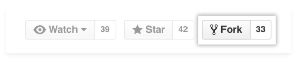
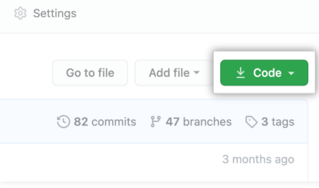
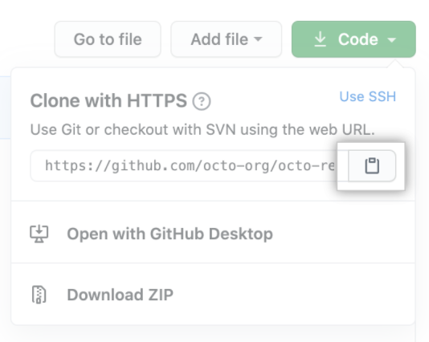
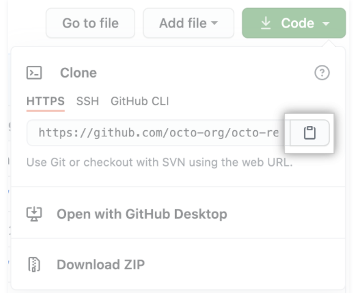

# **Đóng góp cho các dự án (Contributing to projects)**
## Tìm hiểu cách đóng góp cho một dự án thông qua forking

## **Giới thiệu về forking (About forking)**
Sau một thời gian sử dụng GitHub, bạn có thể thấy mình muốn đóng góp cho dự án của người khác. Hoặc có thể bạn muốn sử dụng dự án của ai đó làm điểm khởi đầu cho chính bạn. Quá trình này được gọi là forking.

Tạo một "fork" là tạo ra một bản sao cá nhân của dự án của người khác. Forks hoạt động như một loại cầu nối giữa kho lưu trữ gốc và bản sao cá nhân của bạn. Bạn có thể gửi các yêu cầu kéo để giúp làm cho các dự án của người khác tốt hơn bằng cách đưa ra các thay đổi của bạn so với dự án ban đầu. Forking là cốt lõi của mã hóa xã hội tại GitHub. Để biết thêm thông tin, hãy xem "[Fork a repo](#Bản-sao-kho-lưu-trữ-(Fork-a-repo))".

## **Bản sao chép kho dữ liệu (Forking a repository)**

Hướng dẫn này sử dụng [ the Spoon-Knife project](https://github.com/octocat/Spoon-Knife), một kho lưu trữ thử nghiệm được lưu trữ trên GitHub.com cho phép bạn kiểm tra quy trình làm việc của yêu cầu fork và pull.
- Bước 1: Điều hướng đến dự án `Spoon-Knife` tại https://github.com/octocat/Spoon-Knife.
- Bước 2: Chọn **Fork**.

    

- Bước 3: GitHub sẽ đưa bạn đến bản sao của bạn (your fork) trong kho Spoon-Knife.
### **Cloning a fork (Nhân bản 1 sao chép)**
Bạn đã tách thành công kho lưu trữ Spoon-Knife, nhưng cho đến nay, nó chỉ tồn tại trên GitHub. Để có thể làm việc trong dự án, bạn sẽ cần sao chép nó vào máy tính của mình.

Bạn có thể sao chép fork của mình bằng dòng lệnh, GitHub CLI hoặc GitHub Desktop.
- Bước 1: Trên GitHub, điều hướng đến ngã ba của kho lưu trữ Spoon-Knife (your fork).
- Bước 2: Phía trên danh sách tệp, nhấp vào **Code**

    

- Bước 3: Để sao chép kho lưu trữ bằng HTTPS, trong "Clone with HTTPS", hãy nhấp vào . Để sao chép kho lưu trữ bằng khóa SSH, bao gồm chứng chỉ do cơ quan cấp chứng chỉ SSH của tổ chức bạn cấp, hãy nhấp **Use SSH**, sau đó nhấp vào . Để sao chép kho lưu trữ bằng GitHub CLI, hãy nhấp vào **Use GitHub CLI**, sau đó nhấp vào .

    

    

- Bước 4: Mở Git Bash.
- Bước 5: Thay đổi thư mục làm việc hiện tại thành vị trí mà bạn muốn thư mục được nhân bản.
- Bước 6: Nhập `git clone`, rồi dán URL bạn đã sao chép trước đó. Nó sẽ giống như thế này, với tên người dùng GitHub của bạn thay vì `YOUR-USERNAME`:

        $ git clone https://github.com/YOUR-USERNAME/Spoon-Knife

- Bước 7: Nhấn **Enter**. Bản sao cục bộ của bạn sẽ được tạo.

        $ git clone https://github.com/YOUR-USERNAME/Spoon-Knife
        > Cloning into `Spoon-Knife`...
        > remote: Counting objects: 10, done.
        > remote: Compressing objects: 100% (8/8), done.
        > remove: Total 10 (delta 1), reused 10 (delta 1)
        > Unpacking objects: 100% (10/10), done.

## **Thực hiện và thúc đẩy các thay đổi (Making and pushing changes)**
Hãy tiếp tục và thực hiện một vài thay đổi đối với dự án bằng trình soạn thảo văn bản yêu thích của bạn, chẳng hạn như Atom. Ví dụ: bạn có thể thay đổi văn bản trong `index.html` để thêm tên người dùng GitHub của mình.

Khi bạn đã sẵn sàng để gửi các thay đổi của mình, hãy thực hiện và cam kết các thay đổi của bạn. `git add`. nói với Git rằng bạn muốn bao gồm tất cả các thay đổi của mình trong lần cam kết tiếp theo. `git commit` sẽ chụp nhanh những thay đổi đó.

    git add .
    git commit -m "a short description of the change"

Khi bạn phân chia và xác nhận các tệp, về cơ bản bạn nói với Git, "Được rồi, hãy chụp nhanh các thay đổi của tôi!" Bạn có thể tiếp tục thực hiện nhiều thay đổi hơn và chụp nhanh cam kết hơn.

Ngay bây giờ, các thay đổi của bạn chỉ tồn tại cục bộ. Khi bạn đã sẵn sàng đưa các thay đổi của mình lên GitHub, hãy đẩy các thay đổi của bạn lên điều khiển từ xa.

    git push

## **Thực hiện 1 yêu cầu kéo (Making a pull request)**
Cuối cùng, bạn đã sẵn sàng đề xuất các thay đổi cho dự án chính! Đây là bước cuối cùng trong việc sản xuất một nhánh dự án của người khác và được cho là bước quan trọng nhất. Nếu bạn đã thực hiện một thay đổi mà bạn cảm thấy sẽ mang lại lợi ích cho cả cộng đồng, bạn chắc chắn nên cân nhắc đóng góp lại.

Để làm như vậy, hãy chuyển đến kho lưu trữ trên GitHub nơi dự án của bạn tồn tại. Đối với ví dụ này, nó sẽ có tại `https://www.github.com/ <your_username>/Spoon-Knife`. Bạn sẽ thấy một biểu ngữ cho biết chi nhánh của bạn đi trước octocat: main một lần cam kết. Nhấp vào **Contribute** và sau đó **Open a pull request**.

GitHub sẽ đưa bạn đến một trang hiển thị sự khác biệt giữa fork của bạn và kho lưu trữ `octocat/Spoon-Knife`. Nhấp vào **Create pull request**.

GitHub sẽ đưa bạn đến một trang nơi bạn có thể nhập tiêu đề và mô tả về các thay đổi của mình. Điều quan trọng là phải cung cấp càng nhiều thông tin hữu ích và lý do tại sao bạn lại đưa ra yêu cầu kéo này ngay từ đầu. Chủ dự án cần xác định được liệu sự thay đổi của bạn có hữu ích cho mọi người như bạn nghĩ hay không. Cuối cùng, nhấp vào **Create pull request**.

## **Quản lý phản hồi (Managing feedback)**
Yêu cầu kéo là một lĩnh vực để thảo luận. Trong trường hợp này, Octocat rất bận và có thể sẽ không hợp nhất các thay đổi của bạn. Đối với các dự án khác, đừng cảm thấy khó chịu nếu chủ dự án từ chối yêu cầu kéo của bạn hoặc hỏi thêm thông tin về lý do tại sao nó được thực hiện. Thậm chí có thể chủ dự án chọn không hợp nhất yêu cầu kéo của bạn, và điều đó hoàn toàn ổn. Bản sao của bạn sẽ tồn tại  trên Internet. Và ai biết được - có thể ai đó bạn chưa từng gặp sẽ thấy những thay đổi của bạn có giá trị hơn nhiều so với dự án ban đầu.

## **Tìm dự án (Finding projects)**
Bạn đã tách thành công và đóng góp trở lại kho lưu trữ. Hãy tiếp tục và đóng góp thêm một số thứ nữa! Để biết thêm thông tin, hãy xem "[Finding ways to contribute to open source on GitHub](https://docs.github.com/en/get-started/exploring-projects-on-github/finding-ways-to-contribute-to-open-source-on-github)".
