## **Tạo một kho dữ liệu (Create a repo)**
### Để đưa dự án của bạn lên GitHub, bạn cần tạo một kho lưu trữ để dự án đó tồn tại.
### **Tạo kho dữ liệu (Create a repository)**
Bạn có thể lưu trữ nhiều dự án trong kho GitHub, bao gồm cả các dự án mã nguồn mở. Với các dự án mã nguồn mở, bạn có thể chia sẻ mã để tạo ra phần mềm tốt hơn, đáng tin cậy hơn. Bạn có thể sử dụng kho để cộng tác với những người khác và theo dõi công việc của mình. Để biết thêm thông tin, hãy xem "[Giới thiệu về kho (About repositories)](https://docs.github.com/en/repositories/creating-and-managing-repositories/about-repositories)".

>Lưu ý: Bạn có thể tạo kho lưu trữ công khai cho một dự án nguồn mở. Khi tạo kho lưu trữ công cộng của bạn, hãy đảm bảo bao gồm [tệp giấy phép (license file)](https://choosealicense.com/) xác định cách bạn muốn chia sẻ dự án của mình với người khác. Để biết thêm thông tin về nguồn mở, cụ thể là cách tạo và phát triển một dự án nguồn mở, chúng tôi đã tạo Hướng dẫn nguồn mở sẽ giúp bạn nuôi dưỡng một cộng đồng nguồn mở lành mạnh bằng cách đề xuất các phương pháp hay nhất để tạo và duy trì kho lưu trữ cho dự án nguồn mở của bạn. Bạn cũng có thể tham gia khóa học [GitHub Learning Lab](https://lab.github.com/) miễn phí về duy trì cộng đồng nguồn mở.
- Bước 1: Ở góc trên bên phải của trang bất kỳ, sử dụng menu thả xuống và chọn New repository.

    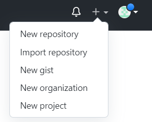

- Bước 2: Nhập tên ngắn gọn, dễ nhớ cho kho lưu trữ của bạn. Ví dụ: "hello-world".

    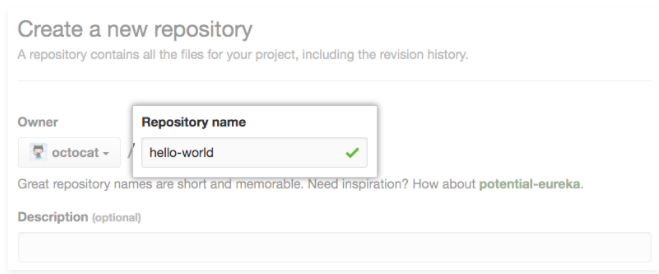

- Bước 3: Theo tùy chọn, thêm mô tả về kho lưu trữ của bạn. Ví dụ: "My first repository on GitHub".

    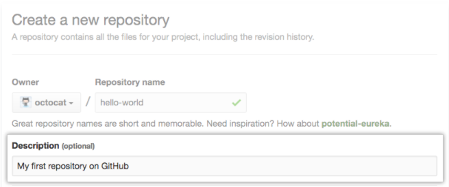

- Bước 4: Chọn khả năng hiển thị của kho lưu trữ.

    

- Bước 5: Chọn **Initialize this repository with a README**.

    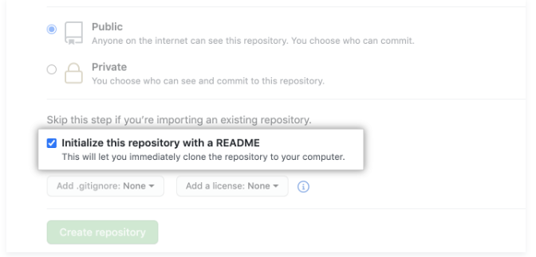

- Bước 6: Chọn **Create repository**.

    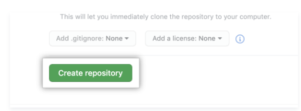

### **Cam kết thay đổi đầu tiên của bạn (Commit your first change)**
Một cam kết giống như một ảnh chụp nhanh của tất cả các tệp trong dự án của bạn tại một thời điểm cụ thể.

Khi bạn tạo kho lưu trữ mới của mình, bạn đã khởi tạo nó bằng tệp README. Tệp README là một nơi tuyệt vời để mô tả dự án của bạn chi tiết hơn hoặc thêm một số tài liệu như cách cài đặt hoặc sử dụng dự án của bạn. Nội dung của tệp README của bạn được tự động hiển thị trên trang đầu của kho lưu trữ của bạn.

Hãy cam kết một thay đổi đối với tệp README.

- Bước 1: Trong danh sách tệp của kho lưu trữ của bạn, hãy nhấp vào **README.md**.

    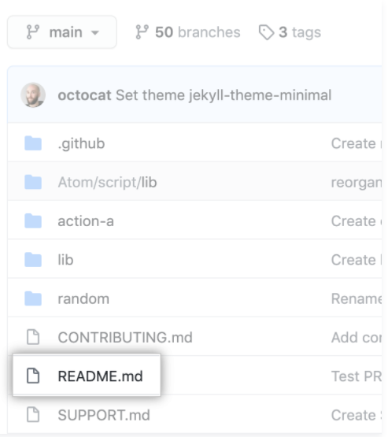

- Bước 2: Chọn biểu tượng **Edit**.
- Bước 3: Trên tab **Edit file**, hãy nhập một số thông tin về bản thân bạn.

    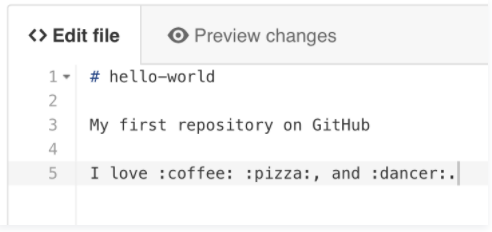

- Bước 4: Phía trên nội dung mới, nhấp vào **Preview changes**.

    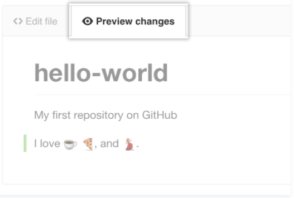

- Bước 5: Xem lại những thay đổi bạn đã thực hiện đối với tệp. Bạn sẽ thấy nội dung mới có màu xanh lục.

    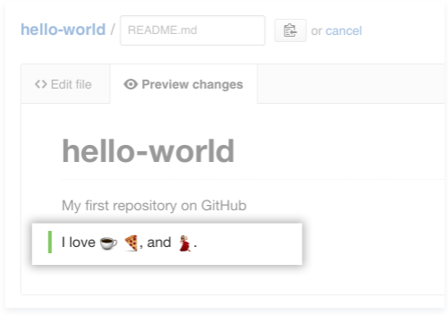

- Bước 6: Ở cuối trang, hãy nhập một thông báo cam kết ngắn gọn, có ý nghĩa mô tả thay đổi bạn đã thực hiện đối với tệp. Bạn có thể gán cam kết cho nhiều tác giả trong thông báo cam kết.

    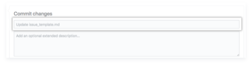

- Bước 7: Bên dưới các trường thông báo cam kết, hãy quyết định thêm cam kết của bạn vào nhánh hiện tại hay vào một nhánh mới. Nếu nhánh hiện tại của bạn là nhánh mặc định, bạn nên chọn tạo nhánh mới cho cam kết của mình và sau đó tạo một yêu cầu kéo. Để biết thêm thông tin, hãy xem "[Tạo một yêu cầu kéo mới (Creating a new pull request)](https://docs.github.com/en/pull-requests/collaborating-with-pull-requests/proposing-changes-to-your-work-with-pull-requests/creating-a-pull-request)".

    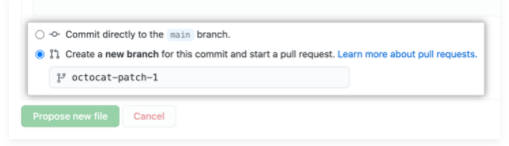

- Bước 8: Chọn **Propose file change**.

    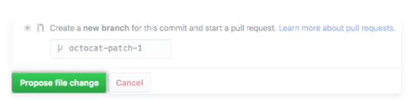
    