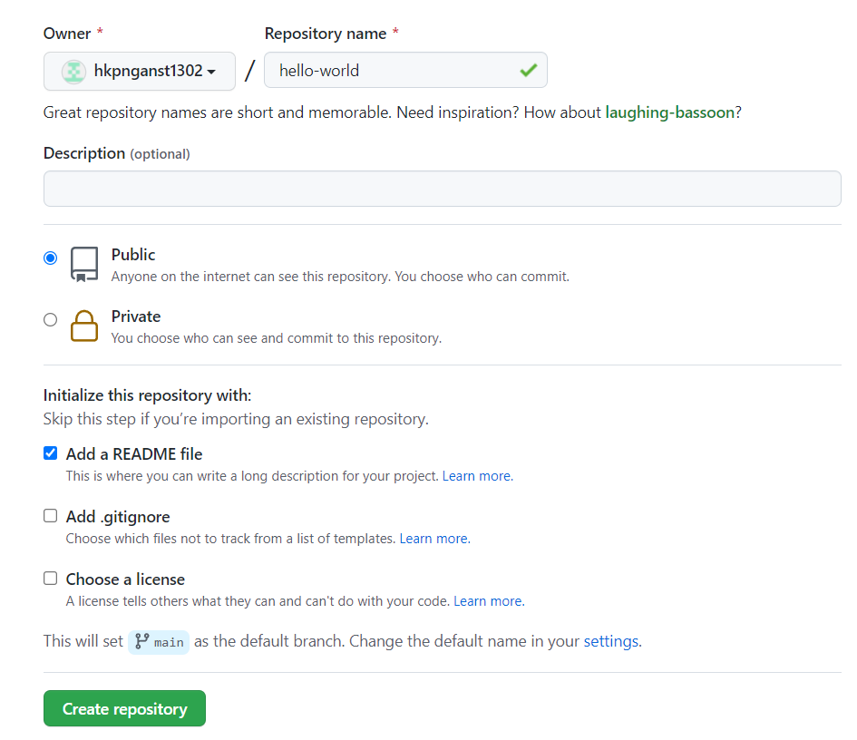
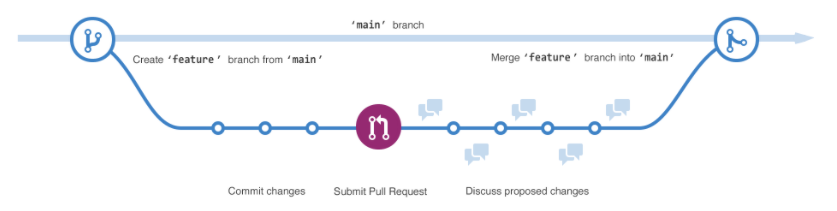
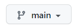
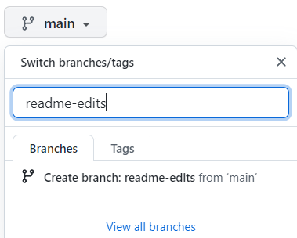
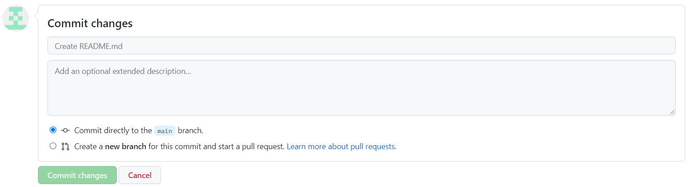
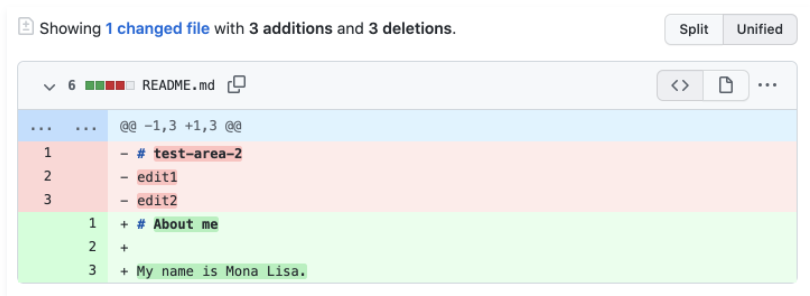

# **TÌM HIỂU NHANH VỀ GitHub**
## **1. Hello word**
Github là một nền tảng lưu trữ mã để kiểm soát phiên bản và sự cộng tác. Nó cho phép bạn và những người khác có thể làm chung các dự án từ khắp mọi nơi.
###      **- Tạo kho lưu trữ (Repository)**
Một kho lưu trữ thường được sử dụng để tổ chức lưu trữ một dự án. Kho lưu trữ có thể chứa thư mục, tệp, hình ảnh, video, tập dữ liệu và bảng tính (Bất cứ thứ gì mà dự án của bạn cần). Thông thường trong kho lưu trữ sẽ bao gồm tệp `README`, tệp chứa thông tin về dự án. Github giúp bạn dễ thực hiện tạo thêm một kho lưu trữ cùng lúc với khi tạo kho lưu trữ mới. Đồng thời nó cũng cung cấp các tùy chọn phổ biến khác như tệp giấy phép.

Kho lưu trữ `hello-word` có thể là nơi lưu trữ các ý tưởng, tài nguyên hoặc có thể chia sẻ và thảo luận mọi thứ với những người khác.

Các bước tạo kho lưu trữ (Repository):
- Bước 1: Tại góc trên bên phải của trang bất kỳ trong Github, sử dụng menu thả xuống và chọn **New repository**

    
- Bước 2: Tại hộp **Repository name**, nhập `hello-word`.
- Bước 3: Tại hộp **Description**, viết đoạn mô tả ngắn.
- Bước 4: Chọn **Add** a README file.
- Bước 5: Chọn **Create repository**.
    

###      **- Tạo nhánh (Branch)**
Việc phân nhánh cho phép bạn có các phiên bản khác nhau của kho lưu trữ trong cùng một lúc. Theo mặc định, kho lưu trữ sẽ có một nhánh chính `main` được coi là nhánh cuối cùng. Bạn có thể sử dụng các nhánh để thử nghiệm và thực hiện chỉnh sửa trước khi chuyển thành nhánh chính.

Khi tạo một nhánh ngoài nhánh chính, bạn đang tạo 1 bản sao hoặc ảnh chụp nhanh của nhánh chính tại thời điểm đó. Nếu có ai đó đã thay đổi đối với nhánh chính trong khi bạn đang làm việc với nhánh của mình thì bạn có thể lấy các bản cập nhất đó.

Sơ đồ này cho thấy:
*	Nhánh chính.

*	Nhánh mới là nhánh `tính năng`(feature).

*	Tiến trình nhánh tính năng thực hiện trước khi hợp nhất với nhánh chính.

    
Tại Github, các nhà phát triển, nhà văn và các nhà thiết kế có thể sử dụng các nhánh chính để lưu giữ các các bản sửa lỗi và các tính năng riêng lẻ với nhánh chính. Khi thay đổi đã sẵn sàng, họ thực hiện hợp nhất thành nhánh chính. 

Các bước tạo chi nhánh:

- Bước 1: Chọn vào tab **Code** của kho lưu trữ hello-world.
- Bước 2: Chọn vào menu thả xuống đầu danh sách tệp có nội dung chính.

    

- Bước 3: Nhập tên chi nhánh `readme-edits` vào hộp văn bản.

    

- Bước 4: Chọn vào **Create branch:readme-edits from main**.

Sau khi thực hiện xong, hiện tại bạn sẽ có 2 nhánh: nhánh chính `main` và nhánh `readme-edits`. Hiện tại, trong chúng sẽ giống hết nhau. Tiếp theo bạn cần thay đổi vào chi nhánh mới.

###      **- Thực hiện và cam kết thay đổi (Making and commit changes)**
Khi đã thực hiện việc tạo một nhánh mới, Github sẽ đưa bạn đến trang mã cho chi nhánh mới đó, đây là một bản sao của main.

Bạn có thể thực hiện và lưu thay đổi đối với các tệp trong kho lưu trữ của bạn. Trên Github, các thay đổi đã lưu được gọi là cam kết (commits). Mỗi cam kết sẽ có một thông báo cam kết liên quan và mô tả giải thích cụ thể lý do tại sao có sự thay đổi. Thông báo cam kết ghi lại lịch sử các thay đổi của bạn để những người đóng góp khác có thể hiểu bạn đã làm gì và tại sao.

- Bước 1: Chọn tệp `README.md`.
- Bước 2: Chọn biểu tượng **Edit this file** để chỉnh sửa.
- Bước 3: Trong phần editor hãy viết một chút về bản thân.
- Bước 4: Trong hộp thoại **Commit changes**, viết thông báo cam kết mô tả sự thay đổi.
- Bước 5: Chọn **Commit changes**.

Những thay đổi này sẽ chỉ được thực hiện đối với tệp README trên nhánh `readme-edits` của bạn, vì vậy bây giờ nhánh này chứa nội dung khác với nhánh chính.

### **- Tạo 1 pull request**
Có những thay đổi trong 1 nhánh ngoài nhánh main, bạn có thể mở 1 **pull request**.

**Pull request** là trọng tâm của sự hợp tác trên GitHub. Khi bạn mở 1 Pull request, bạn đề xuất các thay đổi của mình và yêu cầu ai đó xem xét và thu hút đóng góp của bạn, hợp nhất chúng vào nhánh của họ. Các pull request hiển thị sự khác biệt hoặc khác biệt về nội dung từ cả hai nhánh. Các thay đổi, cộng và trù được hiển thị bằng các màu khác nhau.

Ngay sau khi bạn thực hiện một cam kết, bạn có thể mở một pull request và bắt đầu thảo luận, ngay cả trước khi mã hoàn tất.

Bằng cách sử dụng `@mention` của GitHub trong thông báo pull request, bạn có thể yêu cầu phản hồi từ những người hoặc nhóm cụ thể, cho dù họ ở dưới sảnh hay cách xa bạn 10 múi giờ.
- Bước 1: Chọn **Pull requests** của kho lưu trữ `hello-world`.
- Bước 2: Chọn **New pull request**.
- Bước 3: Trong hộp **Example Comparisons** chọn nhánh đã thực hiện `readme-edits`, để so sánh với nhánh chính `main` (the original).
- Bước 4: Xem lại những thay đổi của bạn trong các điểm khác biệt trên trang Compare, đảm bảo rằng chúng là những gì bạn muốn gửi.

    

- Bước 5: Chọn **Create pull request**.
- Bước 6: Đặt tiêu đề cho pull request và viết mô tả ngắn gọn về các thay đổi. Bạn có thể sử dụng biểu tượng cảm xúc, kéo và thả hình ảnh, gif.
- Bước 7: Chọn **Create pull request**.

Các cộng tác viên của bạn hiện có thể xem xét các chỉnh sửa của bạn và đưa ra đề xuất.
### **- Hợp nhất pull request của bạn**
Trong bước cuối cùng này, bạn sẽ hợp nhất nhánh readme-edits của mình vào nhánh chính.
- Bước 1: Chọn **Merge pull requets** để hợp nhất thành nhánh chính `main`.
- Bước 2: Chọn **Confirm merge**.
- Bước 3: Hãy tiếp tục và xóa chi nhánh, vì các thay đổi của nó đã được kết hợp, bằng cách nhấp vào **Delete branch**.

## **2. Thiết lập GitHub**