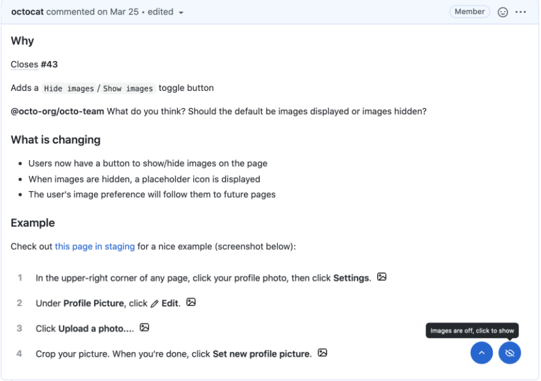
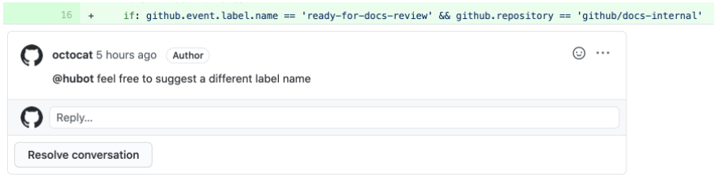

# **TÌM HIỂU NHANH VỀ GitHub**
## **Hello word**
Github là một nền tảng lưu trữ mã để kiểm soát phiên bản và sự cộng tác. Nó cho phép bạn và những người khác có thể làm chung các dự án từ khắp mọi nơi.
###      **Tạo kho lưu trữ (Creating a repository)**
Một kho lưu trữ thường được sử dụng để tổ chức lưu trữ một dự án. Kho lưu trữ có thể chứa thư mục, tệp, hình ảnh, video, tập dữ liệu và bảng tính (Bất cứ thứ gì mà dự án của bạn cần). Thông thường trong kho lưu trữ sẽ bao gồm tệp `README`, tệp chứa thông tin về dự án. Github giúp bạn dễ thực hiện tạo thêm một kho lưu trữ cùng lúc với khi tạo kho lưu trữ mới. Đồng thời nó cũng cung cấp các tùy chọn phổ biến khác như tệp giấy phép.

Kho lưu trữ `hello-word` có thể là nơi lưu trữ các ý tưởng, tài nguyên hoặc có thể chia sẻ và thảo luận mọi thứ với những người khác.

>*Lưu ý* : Bạn có thể tạo kho lưu trữ công khai cho một dự án nguồn mở. Khi tạo kho lưu trữ công cộng của bạn, hãy đảm bảo bao gồm tệp giấy phép xác định cách bạn muốn chia sẻ dự án của mình với người khác. Để biết thêm thông tin về nguồn mở, cụ thể là cách tạo và phát triển một dự án nguồn mở, chúng tôi đã tạo Hướng dẫn nguồn mở sẽ giúp bạn nuôi dưỡng một cộng đồng nguồn mở lành mạnh bằng cách đề xuất các phương pháp hay nhất để tạo và duy trì kho lưu trữ cho dự án nguồn mở của bạn. Bạn cũng có thể tham gia khóa học GitHub Learning Lab miễn phí về duy trì cộng đồng nguồn mở.

Các bước tạo kho lưu trữ (Repository):
- Bước 1: Tại góc trên bên phải của trang bất kỳ trong Github, sử dụng menu thả xuống và chọn **New repository**

    
- Bước 2: Tại hộp **Repository name**, nhập `hello-word`.
- Bước 3: Tại hộp **Description**, viết đoạn mô tả ngắn.
- Bước 4: Chọn **Add** a README file.
- Bước 5: Chọn **Create repository**.
    

###      **Tạo nhánh (Creating a branch)**
Việc phân nhánh cho phép bạn có các phiên bản khác nhau của kho lưu trữ trong cùng một lúc. Theo mặc định, kho lưu trữ sẽ có một nhánh chính `main` được coi là nhánh cuối cùng. Bạn có thể sử dụng các nhánh để thử nghiệm và thực hiện chỉnh sửa trước khi chuyển thành nhánh chính.

Khi tạo một nhánh ngoài nhánh chính, bạn đang tạo 1 bản sao hoặc ảnh chụp nhanh của nhánh chính tại thời điểm đó. Nếu có ai đó đã thay đổi đối với nhánh chính trong khi bạn đang làm việc với nhánh của mình thì bạn có thể lấy các bản cập nhất đó.

Sơ đồ này cho thấy:
*	Nhánh chính.

*	Nhánh mới là nhánh `tính năng`(feature).

*	Tiến trình nhánh tính năng thực hiện trước khi hợp nhất với nhánh chính.

    

Tại Github, các nhà phát triển, nhà văn và các nhà thiết kế có thể sử dụng các nhánh chính để lưu giữ các các bản sửa lỗi và các tính năng riêng lẻ với nhánh chính. Khi thay đổi đã sẵn sàng, họ thực hiện hợp nhất thành nhánh chính. 

Các bước tạo chi nhánh:

- Bước 1: Chọn vào tab **Code** của kho lưu trữ hello-world.
- Bước 2: Chọn vào menu thả xuống đầu danh sách tệp có nội dung chính.

    

- Bước 3: Nhập tên chi nhánh `readme-edits` vào hộp văn bản.

    

- Bước 4: Chọn vào **Create branch:readme-edits from main**.

Sau khi thực hiện xong, hiện tại bạn sẽ có 2 nhánh: nhánh chính `main` và nhánh `readme-edits`. Hiện tại, trong chúng sẽ giống hết nhau. Tiếp theo bạn cần thay đổi vào chi nhánh mới.

###      **Thực hiện và cam kết thay đổi (Making and commit changes)**
Khi đã thực hiện việc tạo một nhánh mới, Github sẽ đưa bạn đến trang mã cho chi nhánh mới đó, đây là một bản sao của main.

Bạn có thể thực hiện và lưu thay đổi đối với các tệp trong kho lưu trữ của bạn. Trên Github, các thay đổi đã lưu được gọi là cam kết (commits). Mỗi cam kết sẽ có một thông báo cam kết liên quan và mô tả giải thích cụ thể lý do tại sao có sự thay đổi. Thông báo cam kết ghi lại lịch sử các thay đổi của bạn để những người đóng góp khác có thể hiểu bạn đã làm gì và tại sao.

- Bước 1: Chọn tệp `README.md`.
- Bước 2: Chọn biểu tượng **Edit this file** để chỉnh sửa.
- Bước 3: Trong phần editor hãy viết một chút về bản thân.
- Bước 4: Trong hộp thoại **Commit changes**, viết thông báo cam kết mô tả sự thay đổi.
- Bước 5: Chọn **Commit changes**.

Những thay đổi này sẽ chỉ được thực hiện đối với tệp README trên nhánh `readme-edits` của bạn, vì vậy bây giờ nhánh này chứa nội dung khác với nhánh chính.

### **Tạo 1 pull request (Opening a pull request)**
Có những thay đổi trong 1 nhánh ngoài nhánh main, bạn có thể mở 1 **pull request**.

**Pull request** là trọng tâm của sự hợp tác trên GitHub. Khi bạn mở 1 Pull request, bạn đề xuất các thay đổi của mình và yêu cầu ai đó xem xét và thu hút đóng góp của bạn, hợp nhất chúng vào nhánh của họ. Các pull request hiển thị sự khác biệt hoặc khác biệt về nội dung từ cả hai nhánh. Các thay đổi, cộng và trừ được hiển thị bằng các màu khác nhau.

Ngay sau khi bạn thực hiện một cam kết, bạn có thể mở một pull request và bắt đầu thảo luận, ngay cả trước khi mã hoàn tất.

Bằng cách sử dụng `@mention` của GitHub trong thông báo pull request, bạn có thể yêu cầu phản hồi từ những người hoặc nhóm cụ thể, cho dù họ ở dưới sảnh hay cách xa bạn 10 múi giờ.
- Bước 1: Chọn **Pull requests** của kho lưu trữ `hello-world`.
- Bước 2: Chọn **New pull request**.
- Bước 3: Trong hộp **Example Comparisons** chọn nhánh đã thực hiện `readme-edits`, để so sánh với nhánh chính `main` (the original).
- Bước 4: Xem lại những thay đổi của bạn trong các điểm khác biệt trên trang Compare, đảm bảo rằng chúng là những gì bạn muốn gửi.

    

- Bước 5: Chọn **Create pull request**.
- Bước 6: Đặt tiêu đề cho pull request và viết mô tả ngắn gọn về các thay đổi. Bạn có thể sử dụng biểu tượng cảm xúc, kéo và thả hình ảnh, gif.
- Bước 7: Chọn **Create pull request**.

Các cộng tác viên của bạn hiện có thể xem xét các chỉnh sửa của bạn và đưa ra đề xuất.
### **- Hợp nhất pull request của bạn (Merging your pull request)**
Trong bước cuối cùng này, bạn sẽ hợp nhất nhánh readme-edits của mình vào nhánh chính.
- Bước 1: Chọn **Merge pull requets** để hợp nhất thành nhánh chính `main`.
- Bước 2: Chọn **Confirm merge**.
- Bước 3: Hãy tiếp tục và xóa chi nhánh, vì các thay đổi của nó đã được kết hợp, bằng cách nhấp vào **Delete branch**.
***
## **Thiết lập GitHub (Set up Git)**
### Trung tâm của GitHub là một hệ thống kiểm soát phiên bản mã nguồn mở (VCS) được gọi là Git. Git chịu trách nhiệm về mọi thứ liên quan đến GitHub xảy ra cục bộ trên máy tính của bạn.
### **Sử dụng Git (Using Git)**
Để sử dụng Git trên dòng lệnh, bạn cần tải xuống, cài đặt và định cấu hình Git trên máy tính của mình. Bạn cũng có thể cài đặt GitHub CLI để sử dụng GitHub từ dòng lệnh. Để biết thêm thông tin, hãy xem "[Giới thiệu về GitHub CLI](https://docs.github.com/en/github-cli/github-cli/about-github-cli)".

Nếu bạn muốn làm việc với Git cục bộ, nhưng không muốn sử dụng dòng lệnh, thay vào đó, bạn có thể tải xuống và cài đặt ứng dụng GitHub Desktop. Để biết thêm thông tin, hãy xem "[Cài đặt và định cấu hình GitHub Desktop](https://docs.github.com/en/desktop/installing-and-configuring-github-desktop)".

Nếu bạn không cần làm việc với các tệp cục bộ, GitHub cho phép bạn hoàn thành nhiều tác vụ liên quan đến Git trực tiếp trong trình duyệt, bao gồm:
- Tạo kho lưu trữ.
- Quản lý tệp.
### **Cài đặt GitHub (Setting up Git)**
- Bước 1. [Tải xuống và cài đặt phiên bản mới nhất của Git](https://git-scm.com/downloads).
- Bước 2: [Đặt tên người dùng của bạn trong Git](https://docs.github.com/en/get-started/getting-started-with-git/setting-your-username-in-git).
- Bước 3: [Đặt địa chỉ email cam kết của bạn trong Git](https://docs.github.com/en/account-and-profile/setting-up-and-managing-your-github-user-account/managing-email-preferences/setting-your-commit-email-address)

### **Tiếp theo, xác thực với GitHub từ Git (Next steps: Authenticating with GitHub from Git)**
Khi bạn kết nối với kho lưu trữ GitHub từ Git, bạn sẽ cần xác thực với GitHub bằng HTTPS hoặc SSH.

>*Note* : Bạn có thể xác thực với GitHub bằng GitHub CLI, cho HTTP hoặc SSH. Để biết thêm thông tin, hãy xem đăng nhập `gh auth login`.

- Kết nối qua HTTPS (khuyến nghị)

    Nếu bạn sao chép bằng HTTPS, bạn có thể lưu thông tin đăng nhập GitHub của mình trong Git bằng cách sử dụng trình trợ giúp thông tin xác thực.
- Kết nối qua SSH

    Nếu bạn sao chép bằng SSH, bạn phải tạo khóa SSH trên mỗi máy tính mà bạn sử dụng để đẩy hoặc kéo từ GitHub.
***
## **Bản sao kho lưu trữ (Fork a repo)**
### Một Fork là một bản sao của một kho lưu trữ. Tạo kho lưu trữ cho phép bạn tự do thử nghiệm với các thay đổi mà không ảnh hưởng đến dự án ban đầu.
### **Giới thiệu về Forks (About forks)**
Thông thường nhất, fork được sử dụng để đề xuất các thay đổi đối với dự án của người khác hoặc sử dụng dự án của người khác làm điểm khởi đầu cho ý tưởng của riêng bạn. Bạn có thể phân nhánh một kho lưu trữ để tạo một bản sao của kho lưu trữ và thực hiện các thay đổi mà không ảnh hưởng đến kho lưu trữ ngược dòng. Để biết thêm thông tin, hãy xem "[Làm việc với forks](https://docs.github.com/en/pull-requests/collaborating-with-pull-requests/working-with-forks)".

### **Đề xuất các thay đổi đối với dự án của người khác (Propose changes to someone else's project)**
*Ví dụ* : bạn có thể sử dụng fork để đề xuất các thay đổi liên quan đến việc sửa lỗi. Thay vì ghi lại sự cố cho một lỗi bạn đã tìm thấy, bạn có thể:
- Fork kho lưu trữ.
- Thực hiện sửa lỗi.
- Gửi 1 pull request tới chủ dự án.

### **Sử dụng dự án của người khác để khởi đầu cho ý tưởng của mình (Use someone else's project as a starting point for your own idea.)**
Phần mềm nguồn mở dựa trên ý tưởng rằng bằng cách chia sẻ mã, chúng ta có thể tạo ra phần mềm tốt hơn, đáng tin cậy hơn. Để biết thêm thông tin, hãy xem "[Giới thiệu về sáng kiến ​​nguồn mở (About the Open Source Initiative)](https://opensource.org/about) " trên sáng kiến ​​nguồn mở (Open Source Initiative).

Để biết thêm thông tin về việc áp dụng các nguyên tắc nguồn mở vào công việc phát triển của tổ chức của bạn trên GitHub.com, hãy xem sách trắng của GitHub "[Giới thiệu về nguồn nội bộ (An introduction to innersource)](https://resources.github.com/whitepapers/introduction-to-innersource/)".

Khi tạo kho lưu trữ công khai của bạn từ một nhánh dự án của ai đó, hãy đảm bảo bao gồm tệp giấy phép xác định cách bạn muốn chia sẻ dự án của mình với người khác. Để biết thêm thông tin, hãy xem "[Chọn giấy phép nguồn mở (Choose an open source license)](https://choosealicense.com/)" tại selectalicense.com.

Để biết thêm thông tin về nguồn mở, cụ thể là cách tạo và phát triển một dự án nguồn mở, chúng tôi đã tạo [Hướng dẫn nguồn mở (Open Source Guides)](https://opensource.guide/) sẽ giúp bạn nuôi dưỡng một cộng đồng nguồn mở lành mạnh bằng cách đề xuất các phương pháp hay nhất để tạo và duy trì kho lưu trữ cho dự án nguồn mở của bạn. Bạn cũng có thể tham gia khóa học [GitHub Learning Lab](https://lab.github.com/) miễn phí về duy trì cộng đồng nguồn mở.
### **Điều kiện tiên quyết (Prerequisites)**
Nếu bạn chưa có, trước tiên bạn nên [thiết lập Git](#Thiết-lập-GitHub). Đừng quên thiết lập xác thực cho GitHub.com từ Git.
### **Tạo kho lưu trữ sao chép(Forking a repository)**
Bạn có thể phân nhánh một dự án để đề xuất các thay đổi đối với kho lưu trữ ngược dòng hoặc bản gốc. Trong trường hợp này, bạn nên thường xuyên đồng bộ fork của mình với kho lưu trữ ngược dòng. Để làm điều này, bạn sẽ cần sử dụng Git trên dòng lệnh. Bạn có thể thực hành thiết lập kho lưu trữ ngược dòng bằng cách sử dụng cùng một kho lưu trữ [octocat / Spoon-Knife](https://github.com/octocat/Spoon-Knife) mà bạn vừa chia nhỏ.
- Bước 1: Trên GitHub.com, điều hướng đến kho lưu trữ [octocat / Spoon-Knife](https://github.com/octocat/Spoon-Knife).
- Bước 2: Ở dóc bên phải của trang, chọn **fork**.

    

### **Nhân bản kho lưu trữ được phân nhánh(Cloning your forked repository)**
Ngay bây giờ, bạn có một nhánh của kho lưu trữ Spoon-Knife, nhưng bạn không có các tệp trong kho đó cục bộ trên máy tính của mình.
- Bước 1: Trên GitHub.com, điều hướng đến **your fork** kho lưu trữ Spoon-Knife.
- Bước 2: Phía trên danh sách các tệp, chọn **Code**.

    

- Bước 3: Để sao chép kho lưu trữ bằng HTTPS, trong "Sao chép bằng HTTPS", hãy nhấp vào . 
Để sao chép kho lưu trữ bằng khóa SSH, bao gồm chứng chỉ do cơ quan cấp chứng chỉ SSH của tổ chức bạn cấp, hãy nhấp vào **Use SSH**, sau đó chọn . Để sao chép kho lưu trữ bằng GitHub CLI, hãy nhấp vào Sử dụng **GitHub CLI**, sau đó nhấp vào .

    

    

- Bước 4: Mở Git Bash.
- Bước 5: Thay đổi thư mục làm việc hiện tại thành vị trí mà bạn muốn thư mục được nhân bản.
- Bước 6: Nhập `git clone`, rồi dán URL bạn đã sao chép trước đó. Nó sẽ giống như thế này, với tên người dùng GitHub của bạn thay vì `YOUR-USERNAME`:
        
        $git clone https://github.com/YOUR-USERNAME/Spoon-Knife

- Bước 7: Nhấn `Enter`. Bản sao cục bộ của bạn sẽ được tạo.
        
        $ git clone https://github.com/YOUR-USERNAME/Spoon-Knife
        > Cloning into `Spoon-Knife`...
        > remote: Counting objects: 10, done.
        > remote: Compressing objects: 100% (8/8), done.
        > remove: Total 10 (delta 1), reused 10 (delta 1)
        > Unpacking objects: 100% (10/10), done.
### **Định cấu hình Git để đồng bộ fork của bạn với kho lưu trữ ban đầu (Configuring Git to sync your fork with the original repository)**
Khi bạn fork một dự án để đề xuất các thay đổi đối với kho lưu trữ ban đầu, bạn có thể định cấu hình Git để kéo các thay đổi từ kho lưu trữ gốc hoặc ngược dòng vào bản sao cục bộ của fork của bạn.
- Bước 1. Trên GitHub.com, điều hướng đến kho lưu trữ [octocat/Spoon-Knife](https://github.com/octocat/Spoon-Knife).
- Bước 2. Phía trên danh sách các tệp, chọn **Code**.

    

- Bước 3. Để sao chép kho lưu trữ bằng HTTPS, trong "Clone with HTTPS",nhấp chọn . Để sao chép kho lưu trữ bằng khóa SSH, bao gồm chứng chỉ do cơ quan cấp chứng chỉ SSH của tổ chức bạn cấp, hãy nhấp vào**Use SSH**, sau đó nhấp vào . Để sao chép kho lưu trữ bằng GitHub CLI, hãy nhấp vào **Use GitHub CLI**, sau đó nhấp vào .

- Bước 4. Mở Git Bash.
- Bước 5. Thay đổi các thư mục đến vị trí của ngã ba mà bạn đã nhân bản.
        * Để đi đến thư mục chính của bạn, nhập `cd` mà không có văn bản nào khác.
        * Để liệt kê các tệp và thư mục trong thư mục hiện tại của bạn, nhập `ls`.
        * Để đi đến một trong các thư mục được liệt kê của bạn, nhập `cd your_listed_directory`.
        * Để truy cập một thư mục, `cd ..`
- Bước 6. Gõ `git remote -v` và nhấn **Enter**. Bạn sẽ thấy kho lưu trữ từ xa được định cấu hình hiện tại cho fork của mình.

            $ git remote -v
            > origin  https://github.com/YOUR_USERNAME/YOUR_FORK.git (fetch)
            > origin  https://github.com/YOUR_USERNAME/YOUR_FORK.git (push)
- Bước 7. Nhập `git remote add upstream`, sau đó dán URL bạn đã sao chép ở bước 2 và nhấn **Enter**. Nó sẽ trông giống thế này:

            $ git remote add upstream https://github.com/octocat/Spoon-Knife.git
- Bước 8. Để xác minh kho lưu trữ ngược dòng mới mà bạn đã chỉ định cho fork của mình, nhập `git remote -v`. Bạn sẽ thấy URL cho bản fork của mình là `origin` và URL cho kho lưu trữ gốc ở dạng `upstream`.

            $ git remote -v
            > origin    https://github.com/YOUR_USERNAME/YOUR_FORK.git (fetch)
            > origin    https://github.com/YOUR_USERNAME/YOUR_FORK.git (push)
            > upstream  https://github.com/ORIGINAL_OWNER/ORIGINAL_REPOSITORY.git (fetch)
            > upstream  https://github.com/ORIGINAL_OWNER/ORIGINAL_REPOSITORY.git (push)

Bây giờ, bạn có thể giữ cho fork của mình được đồng bộ hóa với kho lưu trữ ngược dòng bằng một vài lệnh Git. Để biết thêm thông tin, hãy xem "[Đồng bộ hóa một fork (Syscinga fork)](https://docs.github.com/en/pull-requests/collaborating-with-pull-requests/working-with-forks/syncing-a-fork)".

Tiếp theo, bạn có thể thực hiện bất kỳ thay đổi nào đối với một ngã ba (fork), bao gồm:

* **Tạo các nhánh (Creating branches)**: Các [nhánh (Branches)](https://docs.github.com/en/pull-requests/collaborating-with-pull-requests/proposing-changes-to-your-work-with-pull-requests/creating-and-deleting-branches-within-your-repository) cho phép bạn xây dựng các tính năng mới hoặc thử nghiệm các ý tưởng mà không khiến dự án chính của bạn gặp rủi ro.
* **Mở các yêu cầu kéo (Opening pull requests)**: Nếu bạn hy vọng đóng góp trở lại kho lưu trữ ban đầu, bạn có thể gửi yêu cầu đến tác giả gốc để kéo fork của bạn vào kho lưu trữ của họ bằng cách gửi [yêu cầu kéo (pull request)](https://docs.github.com/en/pull-requests/collaborating-with-pull-requests/proposing-changes-to-your-work-with-pull-requests/about-pull-requests).
### **Tìm một kho lưu trữ khác để phân nhánh (Find another repository to fork)**
Tạo kho lưu trữ để bắt đầu đóng góp cho một dự án. Bạn có thể phân nhánh một kho lưu trữ vào tài khoản người dùng của mình hoặc bất kỳ tổ chức nào mà bạn có quyền tạo kho lưu trữ. Để biết thêm thông tin, hãy xem "[Vai trò trong tổ chức(Roles in an organization)](https://docs.github.com/en/organizations/managing-peoples-access-to-your-organization-with-roles/roles-in-an-organization)".

Nếu bạn có quyền truy cập vào một kho lưu trữ riêng tư và chủ sở hữu cho phép phân nhánh, bạn có thể chuyển kho lưu trữ đó vào tài khoản người dùng của mình hoặc bất kỳ tổ chức nào trên Nhóm GitHub nơi bạn có quyền tạo kho lưu trữ. Bạn không thể chuyển một kho lưu trữ riêng cho một tổ chức bằng GitHub Free. Để biết thêm thông tin, hãy xem "[Sản phẩm của GitHub (GitHub's products)](https://docs.github.com/en/get-started/learning-about-github/githubs-products)."

Bạn có thể duyệt [Explore](https://github.com/explore) để tìm các dự án và bắt đầu đóng góp vào kho mã nguồn mở. Để biết thêm thông tin, hãy xem "[Tìm cách đóng góp cho nguồn mở trên GitHub (Finding ways to contribute to open source on GitHub)](https://docs.github.com/en/get-started/exploring-projects-on-github/finding-ways-to-contribute-to-open-source-on-github)".
*** 
## **Luồng GitHub (GitHub flow)**
### Theo dõi luồng GitHub để cộng tác trong các dự án
### **Giới thiệu (Introduction)**
Luồng GitHub là một luồng công việc dựa trên nhánh. Luồng GitHub hữu ích cho tất cả mọi người, không chỉ các nhà phát triển. Ví dụ: ở đây tại GitHub, chúng tôi sử dụng luồng GitHub cho [trang chính sách (site policy)](https://github.com/github/site-policy), trang [tài liệu(documentation)](https://github.com/github/docs) và [lộ trình (roadmap)](https://github.com/github/roadmap) của chúng tôi.
## **Theo dõi luồng GitHub (Following GitHub flow)**
### **Tạo một chi nhánh (Create a branch)**
Tạo một chi nhánh trong kho lưu trữ của bạn. Tên chi nhánh ngắn gọn, mang tính mô tả cho phép các cộng tác viên của bạn xem nhanh công việc đang diễn ra. Ví dụ: tăng thời gian chờ kiểm tra hoặc thêm quy tắc ứng xử. Để biết thêm thông tin, hãy xem "[Tạo và xóa các nhánh trong kho lưu trữ của bạn (Creating and deleting branches within your repository)](https://docs.github.com/en/pull-requests/collaborating-with-pull-requests/proposing-changes-to-your-work-with-pull-requests/creating-and-deleting-branches-within-your-repository)."

Bằng cách tạo một nhánh, bạn tạo một không gian để làm việc mà không ảnh hưởng đến nhánh mặc định. Ngoài ra, bạn cho các cộng tác viên cơ hội đánh giá công việc của bạn.

### **Thực hiện thay đổi (Make changes)**
Trên chi nhánh của bạn, thực hiện bất kỳ thay đổi mong muốn nào đối với kho lưu trữ. Để biết thêm thông tin, xem "[Tạo tệp mới (Creating new files)](https://docs.github.com/en/repositories/working-with-files/managing-files/creating-new-files)", "[Chỉnh sửa tệp (Editing files)](https://docs.github.com/en/repositories/working-with-files/managing-files/editing-files)", "[Đổi tên tệp (Renaming a file)](https://docs.github.com/en/repositories/working-with-files/managing-files/renaming-a-file)", "[Di chuyển tệp đến một vị trí mới(Moving a file to a new location)](https://docs.github.com/en/repositories/working-with-files/managing-files/moving-a-file-to-a-new-location)" or "[Xóa tệp trong kho lưu trữ (Deleting files in a repository)](https://docs.github.com/en/repositories/working-with-files/managing-files/deleting-files-in-a-repository)".

Chi nhánh của bạn là một nơi an toàn để thực hiện các thay đổi. Nếu bạn mắc lỗi, bạn có thể hoàn nguyên các thay đổi của mình hoặc đẩy các thay đổi bổ sung để sửa lỗi. Các thay đổi của bạn sẽ không kết thúc trên nhánh mặc định cho đến khi bạn hợp nhất nhánh của mình.

Cam kết và đẩy các thay đổi của bạn đến chi nhánh của bạn. Cung cấp cho mỗi cam kết một thông điệp mô tả để giúp bạn và những người đóng góp trong tương lai hiểu những gì thay đổi trong cam kết. Ví dụ, `fix typo` or `increase rate limit`.

Lý tưởng nhất là mỗi cam kết chứa một thay đổi hoàn toàn, riêng biệt. Điều này giúp bạn dễ dàng hoàn nguyên các thay đổi nếu bạn quyết định thực hiện một cách tiếp cận khác. Ví dụ: nếu bạn muốn đổi tên một biến và thêm một số thử nghiệm, hãy đặt đổi tên biến trong một cam kết và các thử nghiệm trong một cam kết khác. Sau đó, nếu bạn muốn giữ lại các thử nghiệm nhưng hoàn nguyên đổi tên biến, bạn có thể hoàn nguyên cam kết cụ thể chứa đổi tên biến. Nếu bạn đặt đổi tên biến và các thử nghiệm trong cùng một cam kết hoặc trải rộng việc đổi tên biến trên nhiều cam kết, bạn sẽ tốn nhiều công sức hơn để hoàn nguyên các thay đổi của mình.

Bằng cách cam kết và đẩy các thay đổi của mình, bạn sao lưu công việc của mình vào bộ nhớ từ xa. Điều này có nghĩa là bạn có thể truy cập công việc của mình từ bất kỳ thiết bị nào. Điều đó cũng có nghĩa là các cộng tác viên của bạn có thể xem công việc của bạn, trả lời câu hỏi và đưa ra đề xuất hoặc đóng góp.

Tiếp tục thực hiện, cam kết và đẩy các thay đổi đối với chi nhánh của bạn cho đến khi bạn sẵn sàng yêu cầu phản hồi.

> Mẹo: Tạo một nhánh riêng cho từng nhóm thay đổi không liên quan. Điều này giúp người đánh giá đưa ra phản hồi dễ dàng hơn. Nó cũng giúp bạn và các cộng tác viên trong tương lai hiểu các thay đổi dễ dàng hơn và hoàn nguyên hoặc xây dựng dựa trên chúng. Ngoài ra, nếu có sự chậm trễ trong một tập hợp các thay đổi, thì các thay đổi khác của bạn cũng không bị trì hoãn.

### **Tạo một yêu cầu kéo (Create a pull request)**
Tạo một yêu cầu kéo để yêu cầu cộng tác viên phản hồi về các thay đổi của bạn. Xem xét yêu cầu kéo có giá trị đến mức một số kho lưu trữ yêu cầu xem xét phê duyệt trước khi yêu cầu kéo có thể được hợp nhất. Nếu bạn muốn có phản hồi hoặc lời khuyên sớm trước khi hoàn thành các thay đổi của mình, bạn có thể đánh dấu yêu cầu kéo của mình dưới dạng bản nháp. Để biết thêm thông tin.

Khi bạn tạo một yêu cầu kéo, hãy bao gồm bản tóm tắt các thay đổi và chúng giải quyết vấn đề gì. Bạn có thể bao gồm hình ảnh, liên kết và bảng để giúp truyền đạt thông tin này. Nếu yêu cầu kéo của bạn giải quyết một vấn đề, hãy liên kết vấn đề để các bên liên quan đến vấn đề biết về yêu cầu kéo và ngược lại. Nếu bạn liên kết với một từ khóa, sự cố sẽ tự động đóng lại khi kết hợp yêu cầu kéo. Để biết thêm thông tin xem [Basic writing and formatting syntax](https://docs.github.com/en/github/writing-on-github/getting-started-with-writing-and-formatting-on-github/basic-writing-and-formatting-syntax) và [Linking a pull request to an issue](https://docs.github.com/en/issues/tracking-your-work-with-issues/linking-a-pull-request-to-an-issue)

Ngoài việc điền vào nội dung của yêu cầu kéo, bạn có thể thêm nhận xét vào các dòng cụ thể của yêu cầu kéo để chỉ ra một cách rõ ràng điều gì đó cho người đánh giá.

Kho lưu trữ của bạn có thể được định cấu hình để tự động yêu cầu xem xét từ các nhóm hoặc người dùng cụ thể khi một yêu cầu kéo được tạo. Bạn cũng có thể @mention theo cách thủ công hoặc yêu cầu đánh giá từ những người hoặc nhóm cụ thể.

Nếu kho lưu trữ của bạn có các kiểm tra được định cấu hình để chạy trên các yêu cầu kéo, bạn sẽ thấy bất kỳ kiểm tra nào không thành công đối với yêu cầu kéo của bạn. Điều này giúp bạn bắt lỗi trước khi hợp nhất chi nhánh của mình. Để biết thêm thông tin xem "[About status checks](https://docs.github.com/en/pull-requests/collaborating-with-pull-requests/collaborating-on-repositories-with-code-quality-features/about-status-checks)".

### **Địa chỉ nhận xét đánh giá (Address review comments)**
Người phản biện nên để lại câu hỏi, nhận xét và đề xuất. Người đánh giá có thể nhận xét về toàn bộ yêu cầu kéo hoặc thêm nhận xét vào các dòng cụ thể. Bạn và người đánh giá có thể chèn hình ảnh hoặc mã đề xuất để làm rõ nhận xét. Để biết thêm thông tin hãy xem "[Reviewing changes in pull requests](https://docs.github.com/en/pull-requests/collaborating-with-pull-requests/reviewing-changes-in-pull-requests)"

### **Hợp nhất yêu cầu kéo của bạn (Merge your pull request)**
Khi yêu cầu kéo của bạn được chấp thuận, hãy hợp nhất yêu cầu kéo của bạn. Thao tác này sẽ tự động hợp nhất chi nhánh của bạn để các thay đổi của bạn xuất hiện trên chi nhánh mặc định. GitHub lưu giữ lịch sử nhận xét và cam kết trong yêu cầu kéo để giúp những người đóng góp trong tương lai hiểu được những thay đổi của bạn. Để biết thêm thông tin, xem "[Merging a pull request](https://docs.github.com/en/pull-requests/collaborating-with-pull-requests/incorporating-changes-from-a-pull-request/merging-a-pull-request)".

GitHub sẽ cho bạn biết nếu yêu cầu kéo của bạn có xung đột cần được giải quyết trước khi hợp nhất. Để biết thêm thông tin, xem "[Addressing merge conflicts](https://docs.github.com/en/pull-requests/collaborating-with-pull-requests/addressing-merge-conflicts)".

Cài đặt bảo vệ nhánh có thể chặn việc hợp nhất nếu yêu cầu kéo của bạn không đáp ứng các yêu cầu nhất định. Ví dụ: bạn cần một số đánh giá phê duyệt nhất định hoặc đánh giá phê duyệt từ một nhóm cụ thể. Để biết thêm thông tin, "[About protected branches](https://docs.github.com/en/repositories/configuring-branches-and-merges-in-your-repository/defining-the-mergeability-of-pull-requests/about-protected-branches)"

### **Xóa chi nhánh của bạn (Delete your branch)**
Sau khi bạn hợp nhất yêu cầu kéo của mình, hãy xóa nhánh của bạn. Điều này cho thấy rằng công việc trên nhánh đã hoàn thành và ngăn bạn hoặc những người khác vô tình sử dụng các nhánh cũ. Để biết thêm thông tin, hãy xem "[Deleting and restoring branches in a pull request](https://docs.github.com/en/repositories/configuring-branches-and-merges-in-your-repository/managing-branches-in-your-repository/deleting-and-restoring-branches-in-a-pull-request)".

Đừng lo lắng về việc mất thông tin. Yêu cầu kéo và lịch sử cam kết của bạn sẽ không bị xóa. Bạn luôn có thể khôi phục nhánh đã xóa của mình hoặc hoàn nguyên yêu cầu kéo của mình nếu cần.