# **TÌM HIỂU NHANH VỀ GitHub**
## **Hello world**
Github là một nền tảng lưu trữ mã để kiểm soát phiên bản và sự cộng tác. Nó cho phép bạn và những người khác có thể làm chung các dự án từ khắp mọi nơi.
###      **Tạo kho lưu trữ (Creating a repository)**
Một kho lưu trữ thường được sử dụng để tổ chức lưu trữ một dự án. Kho lưu trữ có thể chứa thư mục, tệp, hình ảnh, video, tập dữ liệu và bảng tính (Bất cứ thứ gì mà dự án của bạn cần). Thông thường trong kho lưu trữ sẽ bao gồm tệp `README`, tệp chứa thông tin về dự án. Github giúp bạn dễ thực hiện tạo thêm một kho lưu trữ cùng lúc với khi tạo kho lưu trữ mới. Đồng thời nó cũng cung cấp các tùy chọn phổ biến khác như tệp giấy phép.

Kho lưu trữ `hello-word` có thể là nơi lưu trữ các ý tưởng, tài nguyên hoặc có thể chia sẻ và thảo luận mọi thứ với những người khác.

>*Lưu ý* : Bạn có thể tạo kho lưu trữ công khai cho một dự án nguồn mở. Khi tạo kho lưu trữ công cộng của bạn, hãy đảm bảo bao gồm tệp giấy phép xác định cách bạn muốn chia sẻ dự án của mình với người khác. Để biết thêm thông tin về nguồn mở, cụ thể là cách tạo và phát triển một dự án nguồn mở, chúng tôi đã tạo Hướng dẫn nguồn mở sẽ giúp bạn nuôi dưỡng một cộng đồng nguồn mở lành mạnh bằng cách đề xuất các phương pháp hay nhất để tạo và duy trì kho lưu trữ cho dự án nguồn mở của bạn. Bạn cũng có thể tham gia khóa học GitHub Learning Lab miễn phí về duy trì cộng đồng nguồn mở.

Các bước tạo kho lưu trữ (Repository):
- Bước 1: Tại góc trên bên phải của trang bất kỳ trong Github, sử dụng menu thả xuống và chọn **New repository**

    
- Bước 2: Tại hộp **Repository name**, nhập `hello-word`.
- Bước 3: Tại hộp **Description**, viết đoạn mô tả ngắn.
- Bước 4: Chọn **Add** a README file.
- Bước 5: Chọn **Create repository**.
    

###      **Tạo nhánh (Creating a branch)**
Việc phân nhánh cho phép bạn có các phiên bản khác nhau của kho lưu trữ trong cùng một lúc. Theo mặc định, kho lưu trữ sẽ có một nhánh chính `main` được coi là nhánh cuối cùng. Bạn có thể sử dụng các nhánh để thử nghiệm và thực hiện chỉnh sửa trước khi chuyển thành nhánh chính.

Khi tạo một nhánh ngoài nhánh chính, bạn đang tạo 1 bản sao hoặc ảnh chụp nhanh của nhánh chính tại thời điểm đó. Nếu có ai đó đã thay đổi đối với nhánh chính trong khi bạn đang làm việc với nhánh của mình thì bạn có thể lấy các bản cập nhất đó.

Sơ đồ này cho thấy:
*	Nhánh chính.

*	Nhánh mới là nhánh `tính năng`(feature).

*	Tiến trình nhánh tính năng thực hiện trước khi hợp nhất với nhánh chính.

    

Tại Github, các nhà phát triển, nhà văn và các nhà thiết kế có thể sử dụng các nhánh chính để lưu giữ các các bản sửa lỗi và các tính năng riêng lẻ với nhánh chính. Khi thay đổi đã sẵn sàng, họ thực hiện hợp nhất thành nhánh chính. 

Các bước tạo chi nhánh:

- Bước 1: Chọn vào tab **Code** của kho lưu trữ hello-world.
- Bước 2: Chọn vào menu thả xuống đầu danh sách tệp có nội dung chính.

    

- Bước 3: Nhập tên chi nhánh `readme-edits` vào hộp văn bản.

    

- Bước 4: Chọn vào **Create branch:readme-edits from main**.

Sau khi thực hiện xong, hiện tại bạn sẽ có 2 nhánh: nhánh chính `main` và nhánh `readme-edits`. Hiện tại, trong chúng sẽ giống hết nhau. Tiếp theo bạn cần thay đổi vào chi nhánh mới.

###      **Thực hiện và cam kết thay đổi (Making and commit changes)**
Khi đã thực hiện việc tạo một nhánh mới, Github sẽ đưa bạn đến trang mã cho chi nhánh mới đó, đây là một bản sao của main.

Bạn có thể thực hiện và lưu thay đổi đối với các tệp trong kho lưu trữ của bạn. Trên Github, các thay đổi đã lưu được gọi là cam kết (commits). Mỗi cam kết sẽ có một thông báo cam kết liên quan và mô tả giải thích cụ thể lý do tại sao có sự thay đổi. Thông báo cam kết ghi lại lịch sử các thay đổi của bạn để những người đóng góp khác có thể hiểu bạn đã làm gì và tại sao.

- Bước 1: Chọn tệp `README.md`.
- Bước 2: Chọn biểu tượng **Edit this file** để chỉnh sửa.
- Bước 3: Trong phần editor hãy viết một chút về bản thân.
- Bước 4: Trong hộp thoại **Commit changes**, viết thông báo cam kết mô tả sự thay đổi.
- Bước 5: Chọn **Commit changes**.

Những thay đổi này sẽ chỉ được thực hiện đối với tệp README trên nhánh `readme-edits` của bạn, vì vậy bây giờ nhánh này chứa nội dung khác với nhánh chính.

### **Tạo 1 pull request (Opening a pull request)**
Có những thay đổi trong 1 nhánh ngoài nhánh main, bạn có thể mở 1 **pull request**.

**Pull request** là trọng tâm của sự hợp tác trên GitHub. Khi bạn mở 1 Pull request, bạn đề xuất các thay đổi của mình và yêu cầu ai đó xem xét và thu hút đóng góp của bạn, hợp nhất chúng vào nhánh của họ. Các pull request hiển thị sự khác biệt hoặc khác biệt về nội dung từ cả hai nhánh. Các thay đổi, cộng và trừ được hiển thị bằng các màu khác nhau.

Ngay sau khi bạn thực hiện một cam kết, bạn có thể mở một pull request và bắt đầu thảo luận, ngay cả trước khi mã hoàn tất.

Bằng cách sử dụng `@mention` của GitHub trong thông báo pull request, bạn có thể yêu cầu phản hồi từ những người hoặc nhóm cụ thể, cho dù họ ở dưới sảnh hay cách xa bạn 10 múi giờ.
- Bước 1: Chọn **Pull requests** của kho lưu trữ `hello-world`.
- Bước 2: Chọn **New pull request**.
- Bước 3: Trong hộp **Example Comparisons** chọn nhánh đã thực hiện `readme-edits`, để so sánh với nhánh chính `main` (the original).
- Bước 4: Xem lại những thay đổi của bạn trong các điểm khác biệt trên trang Compare, đảm bảo rằng chúng là những gì bạn muốn gửi.

    

- Bước 5: Chọn **Create pull request**.
- Bước 6: Đặt tiêu đề cho pull request và viết mô tả ngắn gọn về các thay đổi. Bạn có thể sử dụng biểu tượng cảm xúc, kéo và thả hình ảnh, gif.
- Bước 7: Chọn **Create pull request**.

Các cộng tác viên của bạn hiện có thể xem xét các chỉnh sửa của bạn và đưa ra đề xuất.
### **- Hợp nhất pull request của bạn (Merging your pull request)**
Trong bước cuối cùng này, bạn sẽ hợp nhất nhánh readme-edits của mình vào nhánh chính.
- Bước 1: Chọn **Merge pull requets** để hợp nhất thành nhánh chính `main`.
- Bước 2: Chọn **Confirm merge**.
- Bước 3: Hãy tiếp tục và xóa chi nhánh, vì các thay đổi của nó đã được kết hợp, bằng cách nhấp vào **Delete branch**.
***
## **Thiết lập GitHub (Set up Git)**
### Trung tâm của GitHub là một hệ thống kiểm soát phiên bản mã nguồn mở (VCS) được gọi là Git. Git chịu trách nhiệm về mọi thứ liên quan đến GitHub xảy ra cục bộ trên máy tính của bạn.
### **Sử dụng Git (Using Git)**
Để sử dụng Git trên dòng lệnh, bạn cần tải xuống, cài đặt và định cấu hình Git trên máy tính của mình. Bạn cũng có thể cài đặt GitHub CLI để sử dụng GitHub từ dòng lệnh. Để biết thêm thông tin, hãy xem "[Giới thiệu về GitHub CLI](https://docs.github.com/en/github-cli/github-cli/about-github-cli)".

Nếu bạn muốn làm việc với Git cục bộ, nhưng không muốn sử dụng dòng lệnh, thay vào đó, bạn có thể tải xuống và cài đặt ứng dụng GitHub Desktop. Để biết thêm thông tin, hãy xem "[Cài đặt và định cấu hình GitHub Desktop](https://docs.github.com/en/desktop/installing-and-configuring-github-desktop)".

Nếu bạn không cần làm việc với các tệp cục bộ, GitHub cho phép bạn hoàn thành nhiều tác vụ liên quan đến Git trực tiếp trong trình duyệt, bao gồm:
- Tạo kho lưu trữ.
- Quản lý tệp.
### **Cài đặt GitHub (Setting up Git)**
- Bước 1. [Tải xuống và cài đặt phiên bản mới nhất của Git](https://git-scm.com/downloads).
- Bước 2: [Đặt tên người dùng của bạn trong Git](https://docs.github.com/en/get-started/getting-started-with-git/setting-your-username-in-git).
- Bước 3: [Đặt địa chỉ email cam kết của bạn trong Git](https://docs.github.com/en/account-and-profile/setting-up-and-managing-your-github-user-account/managing-email-preferences/setting-your-commit-email-address)

### **Tiếp theo, xác thực với GitHub từ Git (Next steps: Authenticating with GitHub from Git)**
Khi bạn kết nối với kho lưu trữ GitHub từ Git, bạn sẽ cần xác thực với GitHub bằng HTTPS hoặc SSH.

>*Note* : Bạn có thể xác thực với GitHub bằng GitHub CLI, cho HTTP hoặc SSH. Để biết thêm thông tin, hãy xem đăng nhập `gh auth login`.

- Kết nối qua HTTPS (khuyến nghị)

    Nếu bạn sao chép bằng HTTPS, bạn có thể lưu thông tin đăng nhập GitHub của mình trong Git bằng cách sử dụng trình trợ giúp thông tin xác thực.
- Kết nối qua SSH

    Nếu bạn sao chép bằng SSH, bạn phải tạo khóa SSH trên mỗi máy tính mà bạn sử dụng để đẩy hoặc kéo từ GitHub.
***
## **Bản sao kho lưu trữ (Fork a repo)**
### Một Fork là một bản sao của một kho lưu trữ. Tạo kho lưu trữ cho phép bạn tự do thử nghiệm với các thay đổi mà không ảnh hưởng đến dự án ban đầu.
### **Giới thiệu về Forks (About forks)**
Thông thường nhất, fork được sử dụng để đề xuất các thay đổi đối với dự án của người khác hoặc sử dụng dự án của người khác làm điểm khởi đầu cho ý tưởng của riêng bạn. Bạn có thể phân nhánh một kho lưu trữ để tạo một bản sao của kho lưu trữ và thực hiện các thay đổi mà không ảnh hưởng đến kho lưu trữ ngược dòng. Để biết thêm thông tin, hãy xem "[Làm việc với forks](https://docs.github.com/en/pull-requests/collaborating-with-pull-requests/working-with-forks)".

### **Đề xuất các thay đổi đối với dự án của người khác (Propose changes to someone else's project)**
*Ví dụ* : bạn có thể sử dụng fork để đề xuất các thay đổi liên quan đến việc sửa lỗi. Thay vì ghi lại sự cố cho một lỗi bạn đã tìm thấy, bạn có thể:
- Fork kho lưu trữ.
- Thực hiện sửa lỗi.
- Gửi 1 pull request tới chủ dự án.

### **Sử dụng dự án của người khác để khởi đầu cho ý tưởng của mình (Use someone else's project as a starting point for your own idea.)**
Phần mềm nguồn mở dựa trên ý tưởng rằng bằng cách chia sẻ mã, chúng ta có thể tạo ra phần mềm tốt hơn, đáng tin cậy hơn. Để biết thêm thông tin, hãy xem "[Giới thiệu về sáng kiến ​​nguồn mở (About the Open Source Initiative)](https://opensource.org/about) " trên sáng kiến ​​nguồn mở (Open Source Initiative).

Để biết thêm thông tin về việc áp dụng các nguyên tắc nguồn mở vào công việc phát triển của tổ chức của bạn trên GitHub.com, hãy xem sách trắng của GitHub "[Giới thiệu về nguồn nội bộ (An introduction to innersource)](https://resources.github.com/whitepapers/introduction-to-innersource/)".

Khi tạo kho lưu trữ công khai của bạn từ một nhánh dự án của ai đó, hãy đảm bảo bao gồm tệp giấy phép xác định cách bạn muốn chia sẻ dự án của mình với người khác. Để biết thêm thông tin, hãy xem "[Chọn giấy phép nguồn mở (Choose an open source license)](https://choosealicense.com/)" tại selectalicense.com.

Để biết thêm thông tin về nguồn mở, cụ thể là cách tạo và phát triển một dự án nguồn mở, chúng tôi đã tạo [Hướng dẫn nguồn mở (Open Source Guides)](https://opensource.guide/) sẽ giúp bạn nuôi dưỡng một cộng đồng nguồn mở lành mạnh bằng cách đề xuất các phương pháp hay nhất để tạo và duy trì kho lưu trữ cho dự án nguồn mở của bạn. Bạn cũng có thể tham gia khóa học [GitHub Learning Lab](https://lab.github.com/) miễn phí về duy trì cộng đồng nguồn mở.
### **Điều kiện tiên quyết (Prerequisites)**
Nếu bạn chưa có, trước tiên bạn nên [thiết lập Git](#Thiết-lập-GitHub). Đừng quên thiết lập xác thực cho GitHub.com từ Git.
### **Tạo kho lưu trữ sao chép(Forking a repository)**
Bạn có thể phân nhánh một dự án để đề xuất các thay đổi đối với kho lưu trữ ngược dòng hoặc bản gốc. Trong trường hợp này, bạn nên thường xuyên đồng bộ fork của mình với kho lưu trữ ngược dòng. Để làm điều này, bạn sẽ cần sử dụng Git trên dòng lệnh. Bạn có thể thực hành thiết lập kho lưu trữ ngược dòng bằng cách sử dụng cùng một kho lưu trữ [octocat / Spoon-Knife](https://github.com/octocat/Spoon-Knife) mà bạn vừa chia nhỏ.
- Bước 1: Trên GitHub.com, điều hướng đến kho lưu trữ [octocat / Spoon-Knife](https://github.com/octocat/Spoon-Knife).
- Bước 2: Ở dóc bên phải của trang, chọn **fork**.

    

### **Nhân bản kho lưu trữ được phân nhánh(Cloning your forked repository)**
Ngay bây giờ, bạn có một nhánh của kho lưu trữ Spoon-Knife, nhưng bạn không có các tệp trong kho đó cục bộ trên máy tính của mình.
- Bước 1: Trên GitHub.com, điều hướng đến **your fork** kho lưu trữ Spoon-Knife.
- Bước 2: Phía trên danh sách các tệp, chọn **Code**.

    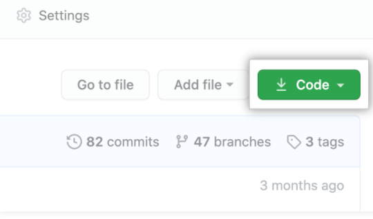

- Bước 3: Để sao chép kho lưu trữ bằng HTTPS, trong "Sao chép bằng HTTPS", hãy nhấp vào . 
Để sao chép kho lưu trữ bằng khóa SSH, bao gồm chứng chỉ do cơ quan cấp chứng chỉ SSH của tổ chức bạn cấp, hãy nhấp vào **Use SSH**, sau đó chọn . Để sao chép kho lưu trữ bằng GitHub CLI, hãy nhấp vào Sử dụng **GitHub CLI**, sau đó nhấp vào .

    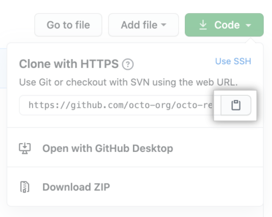

    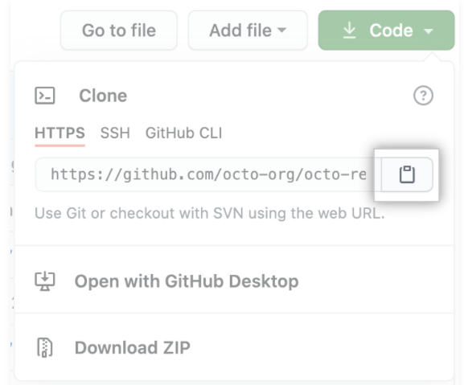

- Bước 4: Mở Git Bash.
- Bước 5: Thay đổi thư mục làm việc hiện tại thành vị trí mà bạn muốn thư mục được nhân bản.
- Bước 6: Nhập `git clone`, rồi dán URL bạn đã sao chép trước đó. Nó sẽ giống như thế này, với tên người dùng GitHub của bạn thay vì `YOUR-USERNAME`:
        
        $git clone https://github.com/YOUR-USERNAME/Spoon-Knife

- Bước 7: Nhấn `Enter`. Bản sao cục bộ của bạn sẽ được tạo.
        
        $ git clone https://github.com/YOUR-USERNAME/Spoon-Knife
        > Cloning into `Spoon-Knife`...
        > remote: Counting objects: 10, done.
        > remote: Compressing objects: 100% (8/8), done.
        > remove: Total 10 (delta 1), reused 10 (delta 1)
        > Unpacking objects: 100% (10/10), done.
### **Định cấu hình Git để đồng bộ fork của bạn với kho lưu trữ ban đầu (Configuring Git to sync your fork with the original repository)**
Khi bạn fork một dự án để đề xuất các thay đổi đối với kho lưu trữ ban đầu, bạn có thể định cấu hình Git để kéo các thay đổi từ kho lưu trữ gốc hoặc ngược dòng vào bản sao cục bộ của fork của bạn.
- Bước 1. Trên GitHub.com, điều hướng đến kho lưu trữ [octocat/Spoon-Knife](https://github.com/octocat/Spoon-Knife).
- Bước 2. Phía trên danh sách các tệp, chọn **Code**.

    

- Bước 3. Để sao chép kho lưu trữ bằng HTTPS, trong "Clone with HTTPS",nhấp chọn . Để sao chép kho lưu trữ bằng khóa SSH, bao gồm chứng chỉ do cơ quan cấp chứng chỉ SSH của tổ chức bạn cấp, hãy nhấp vào**Use SSH**, sau đó nhấp vào . Để sao chép kho lưu trữ bằng GitHub CLI, hãy nhấp vào **Use GitHub CLI**, sau đó nhấp vào .

- Bước 4. Mở Git Bash.
- Bước 5. Thay đổi các thư mục đến vị trí của ngã ba mà bạn đã nhân bản.
        * Để đi đến thư mục chính của bạn, nhập `cd` mà không có văn bản nào khác.
        * Để liệt kê các tệp và thư mục trong thư mục hiện tại của bạn, nhập `ls`.
        * Để đi đến một trong các thư mục được liệt kê của bạn, nhập `cd your_listed_directory`.
        * Để truy cập một thư mục, `cd ..`
- Bước 6. Gõ `git remote -v` và nhấn **Enter**. Bạn sẽ thấy kho lưu trữ từ xa được định cấu hình hiện tại cho fork của mình.

            $ git remote -v
            > origin  https://github.com/YOUR_USERNAME/YOUR_FORK.git (fetch)
            > origin  https://github.com/YOUR_USERNAME/YOUR_FORK.git (push)
- Bước 7. Nhập `git remote add upstream`, sau đó dán URL bạn đã sao chép ở bước 2 và nhấn **Enter**. Nó sẽ trông giống thế này:

            $ git remote add upstream https://github.com/octocat/Spoon-Knife.git
- Bước 8. Để xác minh kho lưu trữ ngược dòng mới mà bạn đã chỉ định cho fork của mình, nhập `git remote -v`. Bạn sẽ thấy URL cho bản fork của mình là `origin` và URL cho kho lưu trữ gốc ở dạng `upstream`.

            $ git remote -v
            > origin    https://github.com/YOUR_USERNAME/YOUR_FORK.git (fetch)
            > origin    https://github.com/YOUR_USERNAME/YOUR_FORK.git (push)
            > upstream  https://github.com/ORIGINAL_OWNER/ORIGINAL_REPOSITORY.git (fetch)
            > upstream  https://github.com/ORIGINAL_OWNER/ORIGINAL_REPOSITORY.git (push)

Bây giờ, bạn có thể giữ cho fork của mình được đồng bộ hóa với kho lưu trữ ngược dòng bằng một vài lệnh Git. Để biết thêm thông tin, hãy xem "[Đồng bộ hóa một fork (Syscinga fork)](https://docs.github.com/en/pull-requests/collaborating-with-pull-requests/working-with-forks/syncing-a-fork)".

Tiếp theo, bạn có thể thực hiện bất kỳ thay đổi nào đối với một ngã ba (fork), bao gồm:

* **Tạo các nhánh (Creating branches)**: Các [nhánh (Branches)](https://docs.github.com/en/pull-requests/collaborating-with-pull-requests/proposing-changes-to-your-work-with-pull-requests/creating-and-deleting-branches-within-your-repository) cho phép bạn xây dựng các tính năng mới hoặc thử nghiệm các ý tưởng mà không khiến dự án chính của bạn gặp rủi ro.
* **Mở các yêu cầu kéo (Opening pull requests)**: Nếu bạn hy vọng đóng góp trở lại kho lưu trữ ban đầu, bạn có thể gửi yêu cầu đến tác giả gốc để kéo fork của bạn vào kho lưu trữ của họ bằng cách gửi [yêu cầu kéo (pull request)](https://docs.github.com/en/pull-requests/collaborating-with-pull-requests/proposing-changes-to-your-work-with-pull-requests/about-pull-requests).
### **Tìm một kho lưu trữ khác để phân nhánh (Find another repository to fork)**
Tạo kho lưu trữ để bắt đầu đóng góp cho một dự án. Bạn có thể phân nhánh một kho lưu trữ vào tài khoản người dùng của mình hoặc bất kỳ tổ chức nào mà bạn có quyền tạo kho lưu trữ. Để biết thêm thông tin, hãy xem "[Vai trò trong tổ chức(Roles in an organization)](https://docs.github.com/en/organizations/managing-peoples-access-to-your-organization-with-roles/roles-in-an-organization)".

Nếu bạn có quyền truy cập vào một kho lưu trữ riêng tư và chủ sở hữu cho phép phân nhánh, bạn có thể chuyển kho lưu trữ đó vào tài khoản người dùng của mình hoặc bất kỳ tổ chức nào trên Nhóm GitHub nơi bạn có quyền tạo kho lưu trữ. Bạn không thể chuyển một kho lưu trữ riêng cho một tổ chức bằng GitHub Free. Để biết thêm thông tin, hãy xem "[Sản phẩm của GitHub (GitHub's products)](https://docs.github.com/en/get-started/learning-about-github/githubs-products)."

Bạn có thể duyệt [Explore](https://github.com/explore) để tìm các dự án và bắt đầu đóng góp vào kho mã nguồn mở. Để biết thêm thông tin, hãy xem "[Tìm cách đóng góp cho nguồn mở trên GitHub (Finding ways to contribute to open source on GitHub)](https://docs.github.com/en/get-started/exploring-projects-on-github/finding-ways-to-contribute-to-open-source-on-github)".
***
## **Tạo một kho dữ liệu (Create a repo)**
### Để đưa dự án của bạn lên GitHub, bạn cần tạo một kho lưu trữ để dự án đó tồn tại.
### **Tạo kho dữ liệu (Create a repository)**
Bạn có thể lưu trữ nhiều dự án trong kho GitHub, bao gồm cả các dự án mã nguồn mở. Với các dự án mã nguồn mở, bạn có thể chia sẻ mã để tạo ra phần mềm tốt hơn, đáng tin cậy hơn. Bạn có thể sử dụng kho để cộng tác với những người khác và theo dõi công việc của mình. Để biết thêm thông tin, hãy xem "[Giới thiệu về kho (About repositories)](https://docs.github.com/en/repositories/creating-and-managing-repositories/about-repositories)".

>Lưu ý: Bạn có thể tạo kho lưu trữ công khai cho một dự án nguồn mở. Khi tạo kho lưu trữ công cộng của bạn, hãy đảm bảo bao gồm [tệp giấy phép (license file)](https://choosealicense.com/) xác định cách bạn muốn chia sẻ dự án của mình với người khác. Để biết thêm thông tin về nguồn mở, cụ thể là cách tạo và phát triển một dự án nguồn mở, chúng tôi đã tạo Hướng dẫn nguồn mở sẽ giúp bạn nuôi dưỡng một cộng đồng nguồn mở lành mạnh bằng cách đề xuất các phương pháp hay nhất để tạo và duy trì kho lưu trữ cho dự án nguồn mở của bạn. Bạn cũng có thể tham gia khóa học [GitHub Learning Lab](https://lab.github.com/) miễn phí về duy trì cộng đồng nguồn mở.
- Bước 1: Ở góc trên bên phải của trang bất kỳ, sử dụng menu thả xuống và chọn New repository.

    

- Bước 2: Nhập tên ngắn gọn, dễ nhớ cho kho lưu trữ của bạn. Ví dụ: "hello-world".

    

- Bước 3: Theo tùy chọn, thêm mô tả về kho lưu trữ của bạn. Ví dụ: "My first repository on GitHub".

    

- Bước 4: Chọn khả năng hiển thị của kho lưu trữ.

    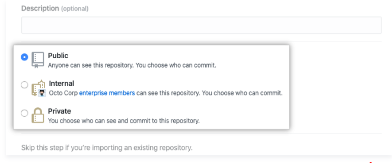

- Bước 5: Chọn **Initialize this repository with a README**.

    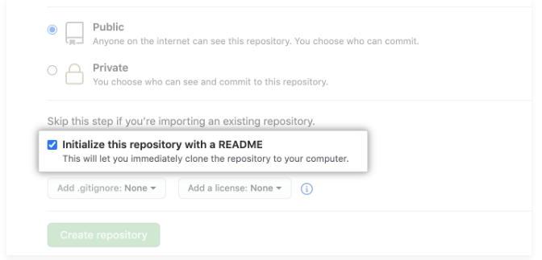

- Bước 6: Chọn **Create repository**.

    

### **Cam kết thay đổi đầu tiên của bạn (Commit your first change)**
Một cam kết giống như một ảnh chụp nhanh của tất cả các tệp trong dự án của bạn tại một thời điểm cụ thể.

Khi bạn tạo kho lưu trữ mới của mình, bạn đã khởi tạo nó bằng tệp README. Tệp README là một nơi tuyệt vời để mô tả dự án của bạn chi tiết hơn hoặc thêm một số tài liệu như cách cài đặt hoặc sử dụng dự án của bạn. Nội dung của tệp README của bạn được tự động hiển thị trên trang đầu của kho lưu trữ của bạn.

Hãy cam kết một thay đổi đối với tệp README.

- Bước 1: Trong danh sách tệp của kho lưu trữ của bạn, hãy nhấp vào **README.md**.

    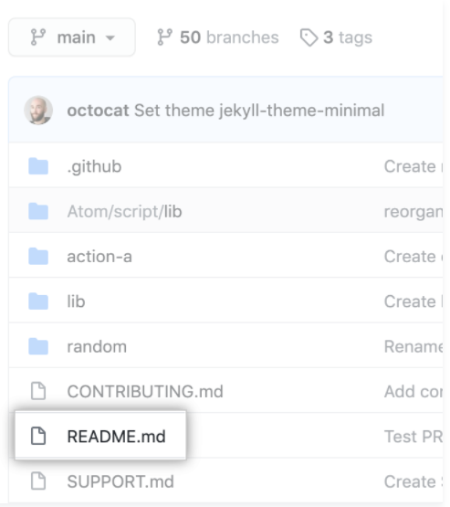

- Bước 2: Chọn biểu tượng **Edit**.
- Bước 3: Trên tab **Edit file**, hãy nhập một số thông tin về bản thân bạn.

    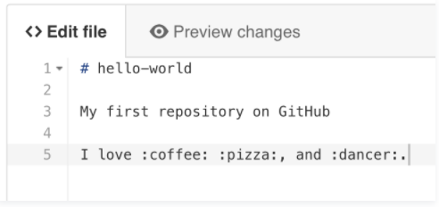

- Bước 4: Phía trên nội dung mới, nhấp vào **Preview changes**.

    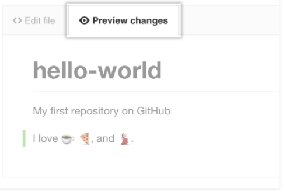

- Bước 5: Xem lại những thay đổi bạn đã thực hiện đối với tệp. Bạn sẽ thấy nội dung mới có màu xanh lục.

    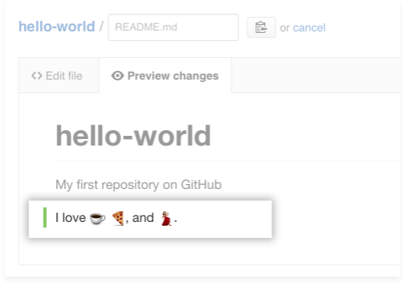

- Bước 6: Ở cuối trang, hãy nhập một thông báo cam kết ngắn gọn, có ý nghĩa mô tả thay đổi bạn đã thực hiện đối với tệp. Bạn có thể gán cam kết cho nhiều tác giả trong thông báo cam kết.

    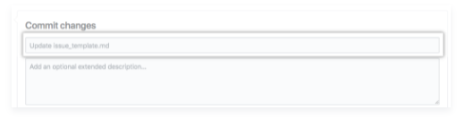

- Bước 7: Bên dưới các trường thông báo cam kết, hãy quyết định thêm cam kết của bạn vào nhánh hiện tại hay vào một nhánh mới. Nếu nhánh hiện tại của bạn là nhánh mặc định, bạn nên chọn tạo nhánh mới cho cam kết của mình và sau đó tạo một yêu cầu kéo. Để biết thêm thông tin, hãy xem "[Tạo một yêu cầu kéo mới (Creating a new pull request)](https://docs.github.com/en/pull-requests/collaborating-with-pull-requests/proposing-changes-to-your-work-with-pull-requests/creating-a-pull-request)".

    

- Bước 8: Chọn **Propose file change**.

    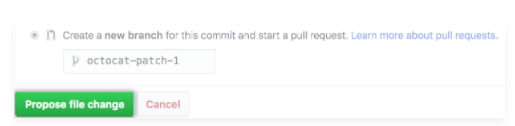
    
*** 
## **Luồng GitHub (GitHub flow)**
### Theo dõi luồng GitHub để cộng tác trong các dự án
### **Giới thiệu (Introduction)**
Luồng GitHub là một luồng công việc dựa trên nhánh. Luồng GitHub hữu ích cho tất cả mọi người, không chỉ các nhà phát triển. Ví dụ: ở đây tại GitHub, chúng tôi sử dụng luồng GitHub cho [trang chính sách (site policy)](https://github.com/github/site-policy), trang [tài liệu(documentation)](https://github.com/github/docs) và [lộ trình (roadmap)](https://github.com/github/roadmap) của chúng tôi.
## **Theo dõi luồng GitHub (Following GitHub flow)**
### **Tạo một chi nhánh (Create a branch)**
Tạo một chi nhánh trong kho lưu trữ của bạn. Tên chi nhánh ngắn gọn, mang tính mô tả cho phép các cộng tác viên của bạn xem nhanh công việc đang diễn ra. Ví dụ: tăng thời gian chờ kiểm tra hoặc thêm quy tắc ứng xử. Để biết thêm thông tin, hãy xem "[Tạo và xóa các nhánh trong kho lưu trữ của bạn (Creating and deleting branches within your repository)](https://docs.github.com/en/pull-requests/collaborating-with-pull-requests/proposing-changes-to-your-work-with-pull-requests/creating-and-deleting-branches-within-your-repository)."

Bằng cách tạo một nhánh, bạn tạo một không gian để làm việc mà không ảnh hưởng đến nhánh mặc định. Ngoài ra, bạn cho các cộng tác viên cơ hội đánh giá công việc của bạn.

### **Thực hiện thay đổi (Make changes)**
Trên chi nhánh của bạn, thực hiện bất kỳ thay đổi mong muốn nào đối với kho lưu trữ. Để biết thêm thông tin, xem "[Tạo tệp mới (Creating new files)](https://docs.github.com/en/repositories/working-with-files/managing-files/creating-new-files)", "[Chỉnh sửa tệp (Editing files)](https://docs.github.com/en/repositories/working-with-files/managing-files/editing-files)", "[Đổi tên tệp (Renaming a file)](https://docs.github.com/en/repositories/working-with-files/managing-files/renaming-a-file)", "[Di chuyển tệp đến một vị trí mới(Moving a file to a new location)](https://docs.github.com/en/repositories/working-with-files/managing-files/moving-a-file-to-a-new-location)" or "[Xóa tệp trong kho lưu trữ (Deleting files in a repository)](https://docs.github.com/en/repositories/working-with-files/managing-files/deleting-files-in-a-repository)".

Chi nhánh của bạn là một nơi an toàn để thực hiện các thay đổi. Nếu bạn mắc lỗi, bạn có thể hoàn nguyên các thay đổi của mình hoặc đẩy các thay đổi bổ sung để sửa lỗi. Các thay đổi của bạn sẽ không kết thúc trên nhánh mặc định cho đến khi bạn hợp nhất nhánh của mình.

Cam kết và đẩy các thay đổi của bạn đến chi nhánh của bạn. Cung cấp cho mỗi cam kết một thông điệp mô tả để giúp bạn và những người đóng góp trong tương lai hiểu những gì thay đổi trong cam kết. Ví dụ, `fix typo` or `increase rate limit`.

Lý tưởng nhất là mỗi cam kết chứa một thay đổi hoàn toàn, riêng biệt. Điều này giúp bạn dễ dàng hoàn nguyên các thay đổi nếu bạn quyết định thực hiện một cách tiếp cận khác. Ví dụ: nếu bạn muốn đổi tên một biến và thêm một số thử nghiệm, hãy đặt đổi tên biến trong một cam kết và các thử nghiệm trong một cam kết khác. Sau đó, nếu bạn muốn giữ lại các thử nghiệm nhưng hoàn nguyên đổi tên biến, bạn có thể hoàn nguyên cam kết cụ thể chứa đổi tên biến. Nếu bạn đặt đổi tên biến và các thử nghiệm trong cùng một cam kết hoặc trải rộng việc đổi tên biến trên nhiều cam kết, bạn sẽ tốn nhiều công sức hơn để hoàn nguyên các thay đổi của mình.

Bằng cách cam kết và đẩy các thay đổi của mình, bạn sao lưu công việc của mình vào bộ nhớ từ xa. Điều này có nghĩa là bạn có thể truy cập công việc của mình từ bất kỳ thiết bị nào. Điều đó cũng có nghĩa là các cộng tác viên của bạn có thể xem công việc của bạn, trả lời câu hỏi và đưa ra đề xuất hoặc đóng góp.

Tiếp tục thực hiện, cam kết và đẩy các thay đổi đối với chi nhánh của bạn cho đến khi bạn sẵn sàng yêu cầu phản hồi.

> Mẹo: Tạo một nhánh riêng cho từng nhóm thay đổi không liên quan. Điều này giúp người đánh giá đưa ra phản hồi dễ dàng hơn. Nó cũng giúp bạn và các cộng tác viên trong tương lai hiểu các thay đổi dễ dàng hơn và hoàn nguyên hoặc xây dựng dựa trên chúng. Ngoài ra, nếu có sự chậm trễ trong một tập hợp các thay đổi, thì các thay đổi khác của bạn cũng không bị trì hoãn.

### **Tạo một yêu cầu kéo (Create a pull request)**
Tạo một yêu cầu kéo để yêu cầu cộng tác viên phản hồi về các thay đổi của bạn. Xem xét yêu cầu kéo có giá trị đến mức một số kho lưu trữ yêu cầu xem xét phê duyệt trước khi yêu cầu kéo có thể được hợp nhất. Nếu bạn muốn có phản hồi hoặc lời khuyên sớm trước khi hoàn thành các thay đổi của mình, bạn có thể đánh dấu yêu cầu kéo của mình dưới dạng bản nháp. Để biết thêm thông tin.

Khi bạn tạo một yêu cầu kéo, hãy bao gồm bản tóm tắt các thay đổi và chúng giải quyết vấn đề gì. Bạn có thể bao gồm hình ảnh, liên kết và bảng để giúp truyền đạt thông tin này. Nếu yêu cầu kéo của bạn giải quyết một vấn đề, hãy liên kết vấn đề để các bên liên quan đến vấn đề biết về yêu cầu kéo và ngược lại. Nếu bạn liên kết với một từ khóa, sự cố sẽ tự động đóng lại khi kết hợp yêu cầu kéo. Để biết thêm thông tin xem [Basic writing and formatting syntax](https://docs.github.com/en/github/writing-on-github/getting-started-with-writing-and-formatting-on-github/basic-writing-and-formatting-syntax) và [Linking a pull request to an issue](https://docs.github.com/en/issues/tracking-your-work-with-issues/linking-a-pull-request-to-an-issue)

Ngoài việc điền vào nội dung của yêu cầu kéo, bạn có thể thêm nhận xét vào các dòng cụ thể của yêu cầu kéo để chỉ ra một cách rõ ràng điều gì đó cho người đánh giá.

Kho lưu trữ của bạn có thể được định cấu hình để tự động yêu cầu xem xét từ các nhóm hoặc người dùng cụ thể khi một yêu cầu kéo được tạo. Bạn cũng có thể @mention theo cách thủ công hoặc yêu cầu đánh giá từ những người hoặc nhóm cụ thể.

Nếu kho lưu trữ của bạn có các kiểm tra được định cấu hình để chạy trên các yêu cầu kéo, bạn sẽ thấy bất kỳ kiểm tra nào không thành công đối với yêu cầu kéo của bạn. Điều này giúp bạn bắt lỗi trước khi hợp nhất chi nhánh của mình. Để biết thêm thông tin xem "[About status checks](https://docs.github.com/en/pull-requests/collaborating-with-pull-requests/collaborating-on-repositories-with-code-quality-features/about-status-checks)".

### **Địa chỉ nhận xét đánh giá (Address review comments)**
Người phản biện nên để lại câu hỏi, nhận xét và đề xuất. Người đánh giá có thể nhận xét về toàn bộ yêu cầu kéo hoặc thêm nhận xét vào các dòng cụ thể. Bạn và người đánh giá có thể chèn hình ảnh hoặc mã đề xuất để làm rõ nhận xét. Để biết thêm thông tin hãy xem "[Reviewing changes in pull requests](https://docs.github.com/en/pull-requests/collaborating-with-pull-requests/reviewing-changes-in-pull-requests)"

### **Hợp nhất yêu cầu kéo của bạn (Merge your pull request)**
Khi yêu cầu kéo của bạn được chấp thuận, hãy hợp nhất yêu cầu kéo của bạn. Thao tác này sẽ tự động hợp nhất chi nhánh của bạn để các thay đổi của bạn xuất hiện trên chi nhánh mặc định. GitHub lưu giữ lịch sử nhận xét và cam kết trong yêu cầu kéo để giúp những người đóng góp trong tương lai hiểu được những thay đổi của bạn. Để biết thêm thông tin, xem "[Merging a pull request](https://docs.github.com/en/pull-requests/collaborating-with-pull-requests/incorporating-changes-from-a-pull-request/merging-a-pull-request)".

GitHub sẽ cho bạn biết nếu yêu cầu kéo của bạn có xung đột cần được giải quyết trước khi hợp nhất. Để biết thêm thông tin, xem "[Addressing merge conflicts](https://docs.github.com/en/pull-requests/collaborating-with-pull-requests/addressing-merge-conflicts)".

Cài đặt bảo vệ nhánh có thể chặn việc hợp nhất nếu yêu cầu kéo của bạn không đáp ứng các yêu cầu nhất định. Ví dụ: bạn cần một số đánh giá phê duyệt nhất định hoặc đánh giá phê duyệt từ một nhóm cụ thể. Để biết thêm thông tin, "[About protected branches](https://docs.github.com/en/repositories/configuring-branches-and-merges-in-your-repository/defining-the-mergeability-of-pull-requests/about-protected-branches)"

### **Xóa chi nhánh của bạn (Delete your branch)**
Sau khi bạn hợp nhất yêu cầu kéo của mình, hãy xóa nhánh của bạn. Điều này cho thấy rằng công việc trên nhánh đã hoàn thành và ngăn bạn hoặc những người khác vô tình sử dụng các nhánh cũ. Để biết thêm thông tin, hãy xem "[Deleting and restoring branches in a pull request](https://docs.github.com/en/repositories/configuring-branches-and-merges-in-your-repository/managing-branches-in-your-repository/deleting-and-restoring-branches-in-a-pull-request)".

Đừng lo lắng về việc mất thông tin. Yêu cầu kéo và lịch sử cam kết của bạn sẽ không bị xóa. Bạn luôn có thể khôi phục nhánh đã xóa của mình hoặc hoàn nguyên yêu cầu kéo của mình nếu cần.

***

## **Đóng góp cho các dự án (Contributing to projects)**
### Tìm hiểu cách đóng góp cho một dự án thông qua forking

### **Giới thiệu về forking (About forking)**
Sau một thời gian sử dụng GitHub, bạn có thể thấy mình muốn đóng góp cho dự án của người khác. Hoặc có thể bạn muốn sử dụng dự án của ai đó làm điểm khởi đầu cho chính bạn. Quá trình này được gọi là forking.

Tạo một "fork" là tạo ra một bản sao cá nhân của dự án của người khác. Forks hoạt động như một loại cầu nối giữa kho lưu trữ gốc và bản sao cá nhân của bạn. Bạn có thể gửi các yêu cầu kéo để giúp làm cho các dự án của người khác tốt hơn bằng cách đưa ra các thay đổi của bạn so với dự án ban đầu. Forking là cốt lõi của mã hóa xã hội tại GitHub. Để biết thêm thông tin, hãy xem "[Fork a repo](#Bản-sao-kho-lưu-trữ-(Fork-a-repo))".

### **Bản sao chép kho dữ liệu (Forking a repository)**

Hướng dẫn này sử dụng [ the Spoon-Knife project](https://github.com/octocat/Spoon-Knife), một kho lưu trữ thử nghiệm được lưu trữ trên GitHub.com cho phép bạn kiểm tra quy trình làm việc của yêu cầu fork và pull.
- Bước 1: Điều hướng đến dự án `Spoon-Knife` tại https://github.com/octocat/Spoon-Knife.
- Bước 2: Chọn **Fork**.

    

- Bước 3: GitHub sẽ đưa bạn đến bản sao của bạn (your fork) trong kho Spoon-Knife.
### **Cloning a fork (Nhân bản 1 sao chép)**
Bạn đã tách thành công kho lưu trữ Spoon-Knife, nhưng cho đến nay, nó chỉ tồn tại trên GitHub. Để có thể làm việc trong dự án, bạn sẽ cần sao chép nó vào máy tính của mình.

Bạn có thể sao chép fork của mình bằng dòng lệnh, GitHub CLI hoặc GitHub Desktop.
- Bước 1: Trên GitHub, điều hướng đến ngã ba của kho lưu trữ Spoon-Knife (your fork).
- Bước 2: Phía trên danh sách tệp, nhấp vào **Code**

    

- Bước 3: Để sao chép kho lưu trữ bằng HTTPS, trong "Clone with HTTPS", hãy nhấp vào . Để sao chép kho lưu trữ bằng khóa SSH, bao gồm chứng chỉ do cơ quan cấp chứng chỉ SSH của tổ chức bạn cấp, hãy nhấp **Use SSH**, sau đó nhấp vào . Để sao chép kho lưu trữ bằng GitHub CLI, hãy nhấp vào **Use GitHub CLI**, sau đó nhấp vào .

    

    

- Bước 4: Mở Git Bash.
- Bước 5: Thay đổi thư mục làm việc hiện tại thành vị trí mà bạn muốn thư mục được nhân bản.
- Bước 6: Nhập `git clone`, rồi dán URL bạn đã sao chép trước đó. Nó sẽ giống như thế này, với tên người dùng GitHub của bạn thay vì `YOUR-USERNAME`:

        $ git clone https://github.com/YOUR-USERNAME/Spoon-Knife

- Bước 7: Nhấn **Enter**. Bản sao cục bộ của bạn sẽ được tạo.

        $ git clone https://github.com/YOUR-USERNAME/Spoon-Knife
        > Cloning into `Spoon-Knife`...
        > remote: Counting objects: 10, done.
        > remote: Compressing objects: 100% (8/8), done.
        > remove: Total 10 (delta 1), reused 10 (delta 1)
        > Unpacking objects: 100% (10/10), done.

### **Thực hiện và thúc đẩy các thay đổi (Making and pushing changes)**
Hãy tiếp tục và thực hiện một vài thay đổi đối với dự án bằng trình soạn thảo văn bản yêu thích của bạn, chẳng hạn như Atom. Ví dụ: bạn có thể thay đổi văn bản trong `index.html` để thêm tên người dùng GitHub của mình.

Khi bạn đã sẵn sàng để gửi các thay đổi của mình, hãy thực hiện và cam kết các thay đổi của bạn. `git add`. nói với Git rằng bạn muốn bao gồm tất cả các thay đổi của mình trong lần cam kết tiếp theo. `git commit` sẽ chụp nhanh những thay đổi đó.

    git add .
    git commit -m "a short description of the change"

Khi bạn phân chia và xác nhận các tệp, về cơ bản bạn nói với Git, "Được rồi, hãy chụp nhanh các thay đổi của tôi!" Bạn có thể tiếp tục thực hiện nhiều thay đổi hơn và chụp nhanh cam kết hơn.

Ngay bây giờ, các thay đổi của bạn chỉ tồn tại cục bộ. Khi bạn đã sẵn sàng đưa các thay đổi của mình lên GitHub, hãy đẩy các thay đổi của bạn lên điều khiển từ xa.

    git push

### **Thực hiện 1 yêu cầu kéo (Making a pull request)**
Cuối cùng, bạn đã sẵn sàng đề xuất các thay đổi cho dự án chính! Đây là bước cuối cùng trong việc sản xuất một nhánh dự án của người khác và được cho là bước quan trọng nhất. Nếu bạn đã thực hiện một thay đổi mà bạn cảm thấy sẽ mang lại lợi ích cho cả cộng đồng, bạn chắc chắn nên cân nhắc đóng góp lại.

Để làm như vậy, hãy chuyển đến kho lưu trữ trên GitHub nơi dự án của bạn tồn tại. Đối với ví dụ này, nó sẽ có tại `https://www.github.com/ <your_username>/Spoon-Knife`. Bạn sẽ thấy một biểu ngữ cho biết chi nhánh của bạn đi trước octocat: main một lần cam kết. Nhấp vào **Contribute** và sau đó **Open a pull request**.

GitHub sẽ đưa bạn đến một trang hiển thị sự khác biệt giữa fork của bạn và kho lưu trữ `octocat/Spoon-Knife`. Nhấp vào **Create pull request**.

GitHub sẽ đưa bạn đến một trang nơi bạn có thể nhập tiêu đề và mô tả về các thay đổi của mình. Điều quan trọng là phải cung cấp càng nhiều thông tin hữu ích và lý do tại sao bạn lại đưa ra yêu cầu kéo này ngay từ đầu. Chủ dự án cần xác định được liệu sự thay đổi của bạn có hữu ích cho mọi người như bạn nghĩ hay không. Cuối cùng, nhấp vào **Create pull request**.

### **Quản lý phản hồi (Managing feedback)**
Yêu cầu kéo là một lĩnh vực để thảo luận. Trong trường hợp này, Octocat rất bận và có thể sẽ không hợp nhất các thay đổi của bạn. Đối với các dự án khác, đừng cảm thấy khó chịu nếu chủ dự án từ chối yêu cầu kéo của bạn hoặc hỏi thêm thông tin về lý do tại sao nó được thực hiện. Thậm chí có thể chủ dự án chọn không hợp nhất yêu cầu kéo của bạn, và điều đó hoàn toàn ổn. Bản sao của bạn sẽ tồn tại  trên Internet. Và ai biết được - có thể ai đó bạn chưa từng gặp sẽ thấy những thay đổi của bạn có giá trị hơn nhiều so với dự án ban đầu.

### **Tìm dự án (Finding projects)**
Bạn đã tách thành công và đóng góp trở lại kho lưu trữ. Hãy tiếp tục và đóng góp thêm một số thứ nữa! Để biết thêm thông tin, hãy xem "[Finding ways to contribute to open source on GitHub](https://docs.github.com/en/get-started/exploring-projects-on-github/finding-ways-to-contribute-to-open-source-on-github)".

***
## **Sự hòa đồng (Be social)**
### Bạn có thể tương tác với mọi người, kho lưu trữ và tổ chức trên GitHub. Xem những người khác đang làm gì và họ đang kết nối với ai từ trang tổng quan cá nhân của bạn.

### **Theo dõi mọi người (Following people)**
Khi theo dõi ai đó trên GitHub, bạn sẽ nhận được thông báo trên trang tổng quan cá nhân về hoạt động của họ. Để biết thêm thông tin, hãy xem "[Giới thiệu về trang tổng quan cá nhân của bạn (About your personal dashboard)](https://docs.github.com/en/account-and-profile/setting-up-and-managing-your-github-user-account/managing-user-account-settings/about-your-personal-dashboard)".

Nhấp vào **Follow** trên trang hồ sơ của một người để theo dõi họ.

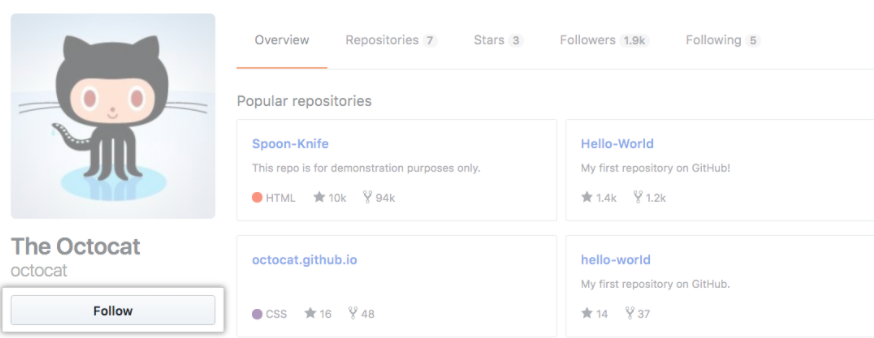

### **Xem kho lưu trữ (Watching a repository)**
Bạn có thể xem kho lưu trữ để nhận thông báo về các vấn đề và yêu cầu kéo mới. Khi chủ sở hữu cập nhật kho lưu trữ, bạn sẽ thấy những thay đổi trong trang tổng quan cá nhân của mình. Để biết thêm thông tin, hãy xem "[Xem đăng ký của bạn (Viewing your subscriptions)](https://docs.github.com/en/account-and-profile/managing-subscriptions-and-notifications-on-github/managing-subscriptions-for-activity-on-github/viewing-your-subscriptions)".

Nhấp vào **Watch** ở đầu kho để xem.

### **Tham gia cuộc trò chuyện (Joining the conversation)**
Bạn có thể kết nối với các nhà phát triển trên khắp thế giới trong [Hỗ trợ cộng đồng GitHub (GitHub Community Support)](https://github.community/) để hỏi và trả lời các câu hỏi, học hỏi và tương tác trực tiếp với nhân viên GitHub.

### **Giao tiếp trên GitHub (Communicating on GitHub)**
GitHub cung cấp các công cụ giao tiếp cộng tác được tích hợp sẵn, chẳng hạn như các vấn đề và yêu cầu kéo, cho phép bạn tương tác chặt chẽ với cộng đồng của mình khi xây dựng phần mềm tuyệt vời. Để biết tổng quan về các công cụ này và thông tin về tính cụ thể của từng công cụ, hãy xem "[Bắt đầu nhanh để giao tiếp trên GitHub (Quickstart for communicating on GitHub)](#Giao-tiếp-trên-GitHub-(Communicating-on-GitHub))."

### **Ngoài ra còn có thể làm nhiều hơn nữa**
### **Tạo 1 yêu cầu kéo (Creating pull requests)**
Bạn có thể muốn đóng góp cho dự án của người khác, cho dù để thêm tính năng hay sửa lỗi. Sau khi thực hiện các thay đổi, hãy cho tác giả ban đầu biết bằng cách gửi yêu cầu kéo. Để biết thêm thông tin, hãy xem "[Giới thiệu về yêu cầu kéo (About pull requests)](https://docs.github.com/en/pull-requests/collaborating-with-pull-requests/proposing-changes-to-your-work-with-pull-requests/about-pull-requests)".

### **Sử dụng issues (Using issues)**
Khi cộng tác trên một kho lưu trữ, hãy sử dụng các vấn đề để theo dõi ý tưởng, cải tiến, nhiệm vụ hoặc lỗi.

### **Tham gia vào các tổ chức (Participating in organizations)**

Các tổ chức là tài khoản dùng chung, nơi các doanh nghiệp và dự án nguồn mở có thể cộng tác trên nhiều dự án cùng một lúc. Chủ sở hữu và quản trị viên có thể thành lập nhóm với các quyền đặc biệt, có hồ sơ tổ chức công khai và theo dõi hoạt động trong tổ chức. Để biết thêm thông tin, hãy xem "[Giới thiệu về tổ chức (About organizations)](https://docs.github.com/en/organizations/collaborating-with-groups-in-organizations/about-organizations)".

### **Khám phá các dự án khác trên GitHub(Exploring other projects on GitHub)**
Khám phá các dự án thú vị bằng cách sử dụng [Explore GitHub](https://github.com/explore), [Explore repositories](https://github.com/explore), và [Trang thịnh hàng (Trending page)](https://github.com/trending). Gắn dấu sao cho các dự án thú vị và quay lại với chúng sau.Truy cập trang sao của bạn để xem tất cả các dự án được gắn dấu sao của bạn.

***

## **Giao tiếp trên GitHub (Communicating on GitHub)**
### **Giới thiệu (Introduction)**
GitHub cung cấp các công cụ giao tiếp cộng tác được tích hợp sẵn cho phép bạn tương tác chặt chẽ với cộng đồng của mình. Hướng dẫn bắt đầu nhanh này sẽ chỉ cho bạn cách chọn công cụ phù hợp với nhu cầu của bạn.

Bạn có thể tạo và tham gia vào các vấn đề, yêu cầu kéo, Thảo luận GitHub và thảo luận nhóm, tùy thuộc vào loại cuộc trò chuyện bạn muốn có.

#### **GitHub issues**
* Rất hữu ích để thảo luận về các chi tiết cụ thể của một dự án như báo cáo lỗi, các cải tiến theo kế hoạch và phản hồi.
* Dành riêng cho một kho lưu trữ và thường có chủ sở hữu rõ ràng.
* Thường được gọi là hệ thống theo dõi lỗi của GitHub

Các tình huống dẫn đến issues
- Tôi muốn theo dõi các nhiệm vụ, cải tiến và lỗi.
- Tôi muốn gửi một báo cáo lỗi.
- Tôi muốn chia sẻ phản hồi về một tính năng cụ thể.
- Tôi muốn hỏi một câu hỏi về các tệp trong kho lưu trữ.

#### **Yêu cầu kéo (Pull requests)**
* Cho phép bạn đề xuất những thay đổi cụ thể
* Cho phép bạn bình luận trực tiếp về các thay đổi được đề xuất do người khác đề xuất.
* Dành riêng cho một kho lưu trữ

Các tình huống dẫn đến issues
- Tôi muốn sửa lỗi đánh máy trong kho lưu trữ.
- Tôi muốn thực hiện các thay đổi đối với một kho lưu trữ.
- Tôi muốn thực hiện các thay đổi để khắc phục sự cố.
- Tôi muốn nhận xét về những thay đổi do người khác đề xuất.

#### **Thảo luận trên GitHub (GitHub Discussions)**
* Giống như một diễn đàn và được sử dụng tốt nhất cho các ý tưởng và cuộc thảo luận dạng mở, nơi mà sự cộng tác là quan trọng.
* Có thể kéo dài nhiều kho lưu trữ.
* Cung cấp trải nghiệm cộng tác bên ngoài cơ sở mã, cho phép động não các ý tưởng và tạo cơ sở kiến ​​thức cộng đồng.
* Thường không có chủ sở hữu rõ ràng.
* Thường không dẫn đến một nhiệm vụ có thể hành động

Các tình huống thảo luận trên GitHub:
- Tôi có một câu hỏi không nhất thiết phải liên quan đến các tệp cụ thể trong kho lưu trữ.
- Tôi muốn chia sẻ tin tức với các cộng tác viên hoặc nhóm của tôi.
- Tôi muốn bắt đầu hoặc tham gia vào một cuộc trò chuyện có kết thúc mở.
- I want to make an announcement to my community.

#### **Thảo luận nhóm (Team discussions)**
Có thể được bắt đầu trên trang của nhóm của bạn cho các cuộc trò chuyện kéo dài qua các dự án và không thuộc về một vấn đề cụ thể hoặc yêu cầu kéo. Thay vì mở một vấn đề trong kho lưu trữ để thảo luận về một ý tưởng, bạn có thể bao gồm toàn bộ nhóm bằng cách trò chuyện trong một cuộc thảo luận nhóm.

Cho phép bạn tổ chức các cuộc thảo luận với nhóm của mình về lập kế hoạch, phân tích, thiết kế, nghiên cứu người dùng và ra quyết định dự án chung ở một nơi.

Các tình huống dẫn đến thảo luận nhóm: 
- Tôi có một câu hỏi không nhất thiết phải liên quan đến các tệp cụ thể trong kho lưu trữ.
- Tôi muốn chia sẻ tin tức với các cộng tác viên hoặc nhóm của tôi.
- Tôi muốn bắt đầu hoặc tham gia vào một cuộc trò chuyện có kết thúc mở.
- Tôi muốn thông báo cho nhóm của mình.

***

## **Thuật ngữ trong GitHub**
### Bảng thuật ngữ này giới thiệu thuật ngữ Git và GitHub phổ biến
### **@mention**
Để thông báo cho một người trên GitHub bằng cách sử dụng `@` trước tên người dùng của họ. Người dùng trong một tổ chức trên GitHub cũng có thể là thành viên của một nhóm có thể được đề cập.

### **Truy cập thẻ (access token)**
Mã thông báo được sử dụng thay cho mật khẩu khi thực hiện các hoạt động Git qua HTTPS với Git trên dòng lệnh hoặc API. Còn được gọi là mã thông báo truy cập cá nhân.

### **API preview**
Một cách để thử các API mới và các thay đổi đối với các phương thức API hiện có trước khi chúng trở thành một phần của API GitHub chính thức.

### **Thiết bị (appliance**
Một ứng dụng phần mềm được kết hợp với hệ điều hành vừa đủ (JeOS) để chạy tối ưu trên phần cứng tiêu chuẩn công nghiệp (thường là máy chủ) hoặc trong một máy ảo.)

### **Người được giao (assignee)**
Người dùng được chỉ định cho một vấn đề

### **Mã xác thực (authentication code)**
Mã bạn sẽ cung cấp, ngoài mật khẩu GitHub của mình, khi đăng nhập bằng 2FA qua trình duyệt. Mã này được tạo bởi một ứng dụng hoặc được gửi đến điện thoại của bạn qua tin nhắn văn bản. Còn được gọi là "mã xác thực 2FA".

### **Chi nhánh cơ sở(base branch)**
Nhánh mà các thay đổi được kết hợp với nhau khi bạn hợp nhất một yêu cầu kéo. Khi bạn tạo một yêu cầu kéo, bạn có thể thay đổi nhánh cơ sở từ nhánh mặc định của kho lưu trữ sang nhánh khác nếu được yêu cầu.

### **Xác thực cơ bản(basic authentication)**
Một phương pháp xác thực trong đó thông tin xác thực được gửi dưới dạng văn bản không được mã hóa.

### **Tiểu sử (Bio)**
Mô tả do người dùng tạo được tìm thấy trên một hồ sơ: [Thêm tiểu sử vào hồ sơ của bạn (Adding a bio to your profile)](https://docs.github.com/en/account-and-profile/setting-up-and-managing-your-github-profile/customizing-your-profile/personalizing-your-profile).

### **Chu kỳ thanh toán (billing cycle)**
Khoảng thời gian cho gói thanh toán cụ thể của bạn.

### **Thanh toán bằng thư điện tử (billing email)**
Địa chỉ email của tổ chức nơi GitHub gửi biên lai, thẻ tín dụng hoặc phí PayPal và các thông tin liên lạc khác liên quan đến thanh toán.

### **Quản lý thanh toán (billing manager)**
Thành viên tổ chức quản lý cài đặt thanh toán cho một tổ chức.

### **Kế hoạch thanh toán (billing plan)**
Gói thanh toán cho người dùng và tổ chức bao gồm các tính năng được thiết lập cho từng loại gói.

### **Blame**
Tính năng "blame" trong Git mô tả lần sửa đổi cuối cùng đối với từng dòng của tệp, thường hiển thị bản sửa đổi, tác giả và thời gian. Điều này rất hữu ích, chẳng hạn, trong việc theo dõi thời điểm một tính năng được thêm vào hoặc cam kết nào dẫn đến một lỗi cụ thể.

### **Chặn (block)**
Để loại bỏ khả năng cộng tác của người dùng trên kho lưu trữ của tổ chức.

### **Nhánh (branch)**
Một nhánh là một phiên bản song song của một kho lưu trữ. Nó được chứa trong kho lưu trữ, nhưng không ảnh hưởng đến nhánh chính hoặc nhánh chính, cho phép bạn làm việc tự do mà không làm gián đoạn phiên bản "sống". Khi bạn đã thực hiện các thay đổi mình muốn, bạn có thể hợp nhất chi nhánh của mình trở lại chi nhánh chính để xuất bản các thay đổi của mình

### **Hạn chế chi nhánh (branch restriction)**
Một hạn chế mà quản trị viên kho lưu trữ có thể bật để chỉ một số người dùng hoặc nhóm nhất định có thể đẩy hoặc thực hiện một số thay đổi nhất định đối với nhánh.

### **Kế hoạch kinh doanh (Business plan)**
Gói thanh toán của tổ chức nơi bạn có thể cộng tác trên các kho lưu trữ công khai và riêng tư không giới hạn, cho phép hoặc yêu cầu các thành viên tổ chức xác thực với GitHub bằng SAML SSO, đồng thời cung cấp và hủy cấp phép quyền truy cập với SAML hoặc SCIM.

### **Chứng chỉ CA (CA certificate)**
Chứng chỉ kỹ thuật số do Tổ chức phát hành chứng chỉ (CA) cấp đảm bảo có các kết nối hợp lệ giữa hai máy, chẳng hạn như máy tính của người dùng và GitHub.com và xác minh quyền sở hữu của một trang web.

### **Card**
Một hình vuông có thể di chuyển trong bảng dự án được liên kết với một vấn đề hoặc yêu cầu kéo.

### **Kiểm tra (check)**
Kiểm tra là một loại kiểm tra trạng thái trên GitHub.

### **Thủ tục thanh toán (checkout)**
Bạn có thể sử dụng `git checkout` trên dòng lệnh để tạo một nhánh mới, thay đổi nhánh làm việc hiện tại của bạn thành một nhánh khác hoặc thậm chí để chuyển sang một phiên bản tệp khác từ một nhánh khác với `git checkout [branchname] [đường dẫn đến tệp]`. Hành động "checkout" cập nhật tất cả hoặc một phần của cây làm việc với một đối tượng cây hoặc đốm màu từ cơ sở dữ liệu đối tượng và cập nhật chỉ mục và HEAD nếu toàn bộ cây làm việc đang trỏ đến một nhánh mới.

### **cherry-picking**
Để chọn một tập hợp con các thay đổi từ một loạt các thay đổi (thường là cam kết) và ghi lại chúng dưới dạng một loạt các thay đổi mới trên cơ sở mã khác. Trong Git, điều này được thực hiện bởi lệnh git cherry-pick để trích xuất thay đổi được giới thiệu bởi một cam kết hiện có trên một nhánh khác và ghi lại nó dựa trên đầu của nhánh hiện tại dưới dạng một cam kết mới. Để biết thêm thông tin, hãy xem [git-cherry-pick](https://git-scm.com/docs/git-cherry-pick) trong tài liệu Git.

### **Nhóm con (child team)**
Trong các nhóm lồng nhau, nhóm phụ kế thừa quyền truy cập của nhóm mẹ và `@mentions`.

### **Sạch (clean)**
Cây làm việc là sạch nếu nó tương ứng với bản sửa đổi được tham chiếu bởi HEAD hiện tại. Cũng thấy "bẩn".

### **Bản sao (clone)**
Bản sao là bản sao của một kho lưu trữ trên máy tính của bạn thay vì trên máy chủ của trang web ở đâu đó hoặc hành động tạo bản sao đó. Khi tạo bản sao, bạn có thể chỉnh sửa các tệp trong trình chỉnh sửa ưa thích của mình và sử dụng Git để theo dõi các thay đổi của bạn mà không cần phải trực tuyến. Kho lưu trữ bạn đã sao chép vẫn được kết nối với phiên bản từ xa để bạn có thể đẩy các thay đổi cục bộ của mình sang điều khiển từ xa để giữ cho chúng được đồng bộ hóa khi bạn trực tuyến

### **clustering**
Khả năng chạy các dịch vụ GitHub Enterprise trên nhiều nút và yêu cầu cân bằng tải giữa chúng.

### **code frequency graph**
Biểu đồ kho lưu trữ hiển thị các nội dung bổ sung và xóa cho mỗi tuần trong lịch sử của kho lưu trữ.

### **Quy tắc ứng xử (code of conduct)**
Một tài liệu xác định các tiêu chuẩn về cách tham gia vào cộng đồng.

### **Chử sở hữu mã (code owner)**
Một người được chỉ định làm chủ sở hữu của một phần mã của kho lưu trữ. Chủ sở hữu mã tự động được yêu cầu xem xét khi ai đó mở một yêu cầu kéo (không ở chế độ nháp) thực hiện các thay đổi đối với mã mà chủ sở hữu mã đó sở hữu.

### **Cộng tác viên (collaborator)**
Cộng tác viên là người có quyền truy cập đọc và ghi vào kho lưu trữ đã được chủ sở hữu kho lưu trữ mời đóng góp.

### **Cam kết (commit)**
Cam kết, hay "bản sửa đổi", là một thay đổi riêng lẻ đối với một tệp (hoặc tập hợp các tệp). Khi bạn thực hiện cam kết lưu công việc của mình, Git sẽ tạo một ID duy nhất (còn gọi là "SHA" hoặc "băm") cho phép bạn ghi lại các thay đổi cụ thể đã cam kết cùng với ai đã thực hiện chúng và khi nào. Các cam kết thường chứa một thông báo cam kết là một mô tả ngắn gọn về những thay đổi đã được thực hiện.

### **Người cam kết (commit author)**
Người dùng thực hiện cam kết

### **Biểu đồ cam kết (Commit graph)**
Biểu đồ kho lưu trữ hiển thị tất cả các cam kết được thực hiện đối với kho lưu trữ trong năm qua.

### **Mã cam kết (commit ID)**
Còn được gọi là SHA. Một băm tổng kiểm tra 40 ký tự xác định cam kết.

### **Thông điệp cam kết (commit message)**
Văn bản mô tả ngắn gọn đi kèm với cam kết và truyền đạt sự thay đổi mà cam kết đang giới thiệu.

### **So sánh nhánh (compare branch)**
Nhánh bạn sử dụng để tạo một yêu cầu kéo. Nhánh này được so sánh với nhánh cơ sở mà bạn chọn cho yêu cầu kéo và các thay đổi được xác định. Khi yêu cầu kéo được hợp nhất, nhánh cơ sở được cập nhật với những thay đổi từ nhánh so sánh. Còn được gọi là "nhánh đầu" của pull request.

### **Hội nhập liên tục (continuous integration)**
Còn được gọi là CI. Một quy trình chạy các bản dựng và kiểm tra tự động sau khi một người thực hiện thay đổi đối với kho lưu trữ đã định cấu hình trên GitHub. CI là một phương pháp hay nhất phổ biến trong phát triển phần mềm giúp phát hiện lỗi.

### **Biểu đồ đóng góp (contribution graph)**
Phần tiểu sử của người dùng hiển thị những đóng góp của họ trong khoảng thời gian lên đến một năm, từng ngày.

### **Hướng dẫn đóng góp (contribution guidelines)**
Tài liệu giải thích cách mọi người nên đóng góp vào dự án của bạn.

### **Đóng góp (contributions)**
Các hoạt động cụ thể trên GitHub sẽ: - Thêm hình vuông vào biểu đồ đóng góp của người dùng: "[Những gì được tính là đóng góp (What counts as a contribution)](https://docs.github.com/en/account-and-profile/setting-up-and-managing-your-github-profile/managing-contribution-graphs-on-your-profile/viewing-contributions-on-your-profile#what-counts-as-a-contribution)" - Thêm hoạt động vào dòng thời gian của người dùng trên hồ sơ của họ: "[Hoạt động đóng góp (Contribution activity)](https://docs.github.com/en/account-and-profile/setting-up-and-managing-your-github-profile/managing-contribution-graphs-on-your-profile/viewing-contributions-on-your-profile#contribution-activity)"

### **Người đóng góp (contributior)**
Người đóng góp là người không có quyền truy cập của cộng tác viên vào kho lưu trữ nhưng đã đóng góp cho một dự án và có một yêu cầu kéo mà họ đã mở đã hợp nhất vào kho lưu trữ.

### **Biểu đồ người đóng góp (contributior graph)**
Biểu đồ kho lưu trữ hiển thị 100 người đóng góp hàng đầu cho kho lưu trữ.
### **Coupon**
Mã do GitHub cung cấp mà người dùng hoặc tổ chức có thể sử dụng để thanh toán cho tất cả hoặc một phần đăng ký của họ.
### **Cron**
Bộ lập lịch công việc dựa trên thời gian trong hệ điều hành máy tính giống Unix.

### **cURL**
Được sử dụng trong các dòng lệnh hoặc tập lệnh để truyền dữ liệu

### **Bảng điều khiển (dashboard)**
Trang tổng quan cá nhân của bạn là trung tâm hoạt động chính của bạn trên GitHub. Từ trang tổng quan cá nhân của mình, bạn có thể theo dõi các vấn đề và lấy các yêu cầu mà bạn đang theo dõi hoặc đang làm việc, điều hướng đến các kho lưu trữ hàng đầu và các trang nhóm của bạn, đồng thời tìm hiểu về hoạt động gần đây trong các kho lưu trữ mà bạn đang xem hoặc tham gia. Bạn cũng có thể khám phá các kho lưu trữ mới, được đề xuất dựa trên những người dùng bạn đang theo dõi và các kho lưu trữ bạn đã gắn dấu sao. Để chỉ xem hoạt động cho một tổ chức cụ thể, hãy truy cập trang tổng quan của tổ chức bạn.

### **Chi nhánh mặc định (default branch)**
Nhánh cơ sở cho các yêu cầu kéo mới và mã cam kết trong một kho lưu trữ. Mỗi kho lưu trữ có ít nhất một nhánh, Git tạo ra khi bạn khởi tạo kho lưu trữ. Nhánh đầu tiên thường được gọi là `chính` (`main`), và thường là nhánh mặc định.

### **Dependents graph**
Biểu đồ kho lưu trữ hiển thị các gói, dự án và kho phụ thuộc vào kho lưu trữ công cộng.

### **Dependency graph**
Biểu đồ kho lưu trữ hiển thị các gói và dự án mà kho lưu trữ phụ thuộc vào.

### **Khóa triển khai (deploy key)**
Khóa triển khai là khóa SSH được lưu trữ trên máy chủ của bạn và cấp quyền truy cập vào một kho lưu trữ GitHub. Khóa này được gắn trực tiếp vào kho thay vì vào tài khoản người dùng cá nhân.

### **Detached HEAD**
Git sẽ cảnh báo bạn nếu bạn đang làm việc trên `Detached HEAD`, có nghĩa là Git không trỏ đến một nhánh và bất kỳ cam kết nào bạn thực hiện sẽ không xuất hiện trong lịch sử cam kết. Ví dụ: khi bạn kiểm tra một cam kết tùy ý không phải là cam kết mới nhất của bất kỳ nhánh cụ thể nào, bạn đang làm việc trên một "Detached HEAD.
### **Diagnostics**
Tổng quan về cài đặt và môi trường của phiên bản GitHub Enterprise.

### **Diff**
Một diff là sự khác biệt về các thay đổi giữa hai lần cam kết hoặc các thay đổi đã lưu. Diff sẽ mô tả trực quan những gì đã được thêm vào hoặc xóa khỏi tệp kể từ lần cam kết cuối cùng của nó.

### **Bẩn (dirty)**
Một cây làm việc được coi là "bẩn" nếu nó chứa các sửa đổi chưa được cam kết cho nhánh hiện tại.

### **Thông báo thư điện tử (email notifications)**
Thông báo được gửi đến địa chỉ email của người dùng

### **Tài khoản doanh nghiệp (enterprise account)**
Tài khoản doanh nghiệp cho phép bạn quản lý tập trung chính sách và thanh toán cho nhiều tổ chức GitHub.com. Tài khoản doanh nghiệp khả dụng với GitHub Enterprise Cloud và GitHub Enterprise Server. Để biết thêm thông tin "[About enterprise accounts](https://docs.github.com/en/enterprise-cloud@latest/admin/overview/about-enterprise-accounts)"

### **Explorer**
Một ví dụ của GraphiQL, là "IDE GraphQL tương tác đồ họa trong trình duyệt."

### **Fast-forward**
Là một kiểu hợp nhất đặc biệt trong đó bạn có một bản sửa đổi và bạn đang "hợp nhất" các thay đổi của nhánh khác mà tình cờ là hậu duệ của những gì bạn có. Trong trường hợp như vậy, bạn không thực hiện một cam kết hợp nhất mới mà thay vào đó chỉ cần cập nhật bản sửa đổi này. Điều này sẽ xảy ra thường xuyên trên một nhánh theo dõi từ xa của một kho lưu trữ từ xa.

### **Nhánh tính năng (feature branch)**
Một nhánh được sử dụng để thử nghiệm tính năng mới hoặc khắc phục sự cố không có trong sản xuất. Cũng được gọi là một nhánh chủ đề.

### **Fenced code block**
Một khối mã được thụt lề mà bạn có thể tạo với GitHub Flavored Markdown bằng cách sử dụng ba dấu gạch ngược `` trước và sau khối mã

### **Fetch**
Khi bạn sử dụng `git fetch`, bạn đang thêm các thay đổi từ kho lưu trữ từ xa vào nhánh làm việc cục bộ của mình mà không cần thực hiện chúng. Không giống như git pull, tìm nạp cho phép bạn xem xét các thay đổi trước khi đưa chúng vào chi nhánh cục bộ của bạn.
### **Following (users)**
Để nhận thông báo về những đóng góp và hoạt động của người dùng khác.

### **Force push**
Git push ghi đè kho lưu trữ từ xa bằng các thay đổi cục bộ mà không tính đến xung đột.

### **Fork**
Là một bản sao cá nhân của kho lưu trữ của người dùng khác nằm trên tài khoản của bạn. Forks cho phép bạn tự do thực hiện các thay đổi đối với dự án mà không ảnh hưởng đến kho lưu trữ ngược dòng ban đầu. Bạn cũng có thể mở một yêu cầu kéo trong kho lưu trữ ngược dòng và giữ cho fork của bạn được đồng bộ hóa với những thay đổi mới nhất vì cả hai kho vẫn được kết nối.

### **Gói thanh toán miễn phí (Free plan)**
Gói thanh toán tài khoản người dùng miễn phí. Người dùng có thể cộng tác trên các kho công khai không giới hạn với số lượng cộng tác viên không giới hạn.

### **Gist**
Là một tệp có thể chia sẻ mà bạn có thể chỉnh sửa, sao chép và phân nhánh trên GitHub. Bạn có thể đặt gist ở chế độ công khai hoặc bí mật, mặc dù gist bí mật sẽ có sẵn cho bất kỳ ai có URL.

### **Git**
Git là một chương trình mã nguồn mở để theo dõi các thay đổi trong tệp văn bản. Nó được viết bởi tác giả của hệ điều hành Linux và là công nghệ cốt lõi mà GitHub, giao diện xã hội và người dùng, được xây dựng trên đó.

### **GitHub App**
Ứng dụng GitHub cung cấp dịch vụ cho toàn bộ tổ chức và sử dụng danh tính riêng của họ khi thực hiện chức năng của họ. Chúng có thể được cài đặt trực tiếp trên các tổ chức và tài khoản người dùng và được cấp quyền truy cập vào các kho lưu trữ cụ thể. Chúng đi kèm với các quyền chi tiết và webhook tích hợp sẵn.

### **GitHub Flavored Markdown**
Markdown dành riêng cho GitHub được sử dụng để định dạng văn xuôi và mã trên GitHub.

### **Trình nhập GitHub (GitHub Importer)**
Một công cụ nhanh chóng nhập kho mã nguồn, bao gồm các cam kết và lịch sử sửa đổi, vào GitHub cho người dùng.

### **Việc làm trên GitHub (GitHub Jobs)**
Trang GitHub nơi nhà tuyển dụng có thể đăng công việc mà người dùng GitHub có thể quan tâm.

### **Thị trường GitHub (GitHub Marketplace)**
Một trang con dành cho người dùng GitHub và các tổ chức để mua và cài đặt các ứng dụng mở rộng và bổ sung cho quy trình làm việc của họ. 

### **Trang GitHub (GitHub Pages)**
Còn được gọi là Trang. Dịch vụ lưu trữ trang web tĩnh được thiết kế để lưu trữ các trang cá nhân, tổ chức hoặc dự án của bạn trực tiếp từ kho lưu trữ GitHub.

### **GitHub Wiki**
Một phần để lưu trữ tài liệu kiểu wiki trên kho lưu trữ GitHub.

### **(coupon)**
Một tệp `.git` thuần túy, luôn nằm ở gốc của cây làm việc và trỏ đến thư mục Git, có toàn bộ kho lưu trữ Git và dữ liệu meta của nó. Bạn có thể xem tệp này cho kho lưu trữ của mình trên dòng lệnh với `git rev-parse --git-dir`. Đó là kho lưu trữ thực sự.

### **GraphQL**
Ngôn ngữ truy vấn cho các API và thời gian chạy để thực hiện các truy vấn đó với dữ liệu hiện có của bạn.

### **HEAD**
Một cam kết xác định của một nhánh, thường là cam kết gần đây nhất ở đầu nhánh.

### **Nhánh đầu (head branch)**
Nhánh có các thay đổi được kết hợp thành nhánh cơ sở khi bạn hợp nhất một yêu cầu kéo. Còn được gọi là "nhánh so sánh".

### **Hello, World**
Một câu "Hello, World!" chương trình là một chương trình máy tính xuất hoặc hiển thị "Hello, World!" cho một người dùng. Vì chương trình này thường rất đơn giản, nên nó thường được dùng làm ví dụ về cú pháp cơ bản của ngôn ngữ lập trình và dùng như một bài tập đầu tiên phổ biến để học một ngôn ngữ lập trình mới.

### **Tính khả dụng cao (high-availability)**
Hệ thống hoặc thành phần hoạt động liên tục trong một khoảng thời gian dài đáng mơ ước.

### **Hook**
Trong quá trình thực thi bình thường một số lệnh Git, lệnh gọi được thực hiện đối với các tập lệnh tùy chọn cho phép nhà phát triển thêm chức năng hoặc kiểm tra. Thông thường, các hook cho phép một lệnh được xác minh trước và có khả năng bị hủy bỏ, đồng thời cho phép thông báo hậu sau khi hoạt động hoàn tất.

### **Tên máy chủ (Hostname)**
Các biệt hiệu mà con người có thể đọc được tương ứng với địa chỉ của thiết bị được kết nối với mạng.

### **Danh tính (Identicon)**
Hình ảnh được tạo tự động được sử dụng làm ảnh hồ sơ mặc định khi người dùng đăng ký GitHub. Người dùng có thể thay thế danh tính của họ bằng ảnh hồ sơ của riêng họ.

### **Danh tính nhà cung cấp (Identity provider)**
Còn được gọi là IdP. Nhà cung cấp đáng tin cậy cho phép bạn sử dụng đăng nhập một lần SAML (SSO) để truy cập các trang web khác.

### **Instance**
Bản sao GitHub riêng tư của một tổ chức chứa trong một máy ảo mà họ định cấu hình và kiểm soát

### **Integration**
Một ứng dụng của bên thứ ba tích hợp với GitHub. Đây có thể là Ứng dụng GitHub, Ứng dụng OAuth hoặc webhook.

### **Issue**
Các vấn đề được đề xuất cải tiến, nhiệm vụ hoặc câu hỏi liên quan đến kho lưu trữ. Bất kỳ ai cũng có thể tạo ra các vấn đề (đối với kho lưu trữ công khai) và được kiểm duyệt bởi các cộng tác viên của kho lưu trữ. Mỗi vấn đề chứa chủ đề thảo luận riêng của nó. Bạn cũng có thể phân loại vấn đề bằng nhãn và gán nó cho ai đó.

### **Jekyll**
Trình tạo trang tĩnh cho các trang cá nhân, dự án hoặc tổ chức.

### **Trình chọn chủ đề Jekyll (Jekyll Theme Chooser)**
Một cách tự động để chọn chủ đề trực quan cho trang web Jekyll của bạn mà không cần chỉnh sửa hoặc sao chép tệp CSS.

### **Key fingerprint**
Một chuỗi byte ngắn được sử dụng để xác định khóa công khai dài hơn.

### **Keychain**
Hệ thống quản lý mật khẩu trong macOS.

### **Từ khóa (keyword)**
Một từ cụ thể đóng một vấn đề khi được sử dụng trong một yêu cầu kéo.

### **Nhãn (label)**
Một thẻ về một vấn đề hoặc yêu cầu kéo. Kho lưu trữ đi kèm với một số nhãn mặc định, nhưng người dùng có thể tạo nhãn tùy chỉnh.

### **LFS**
Lưu trữ tệp lớn Git. Một phần mở rộng Git mã nguồn mở để tạo phiên bản cho các tệp lớn.

### **Giấy phép (license)**
Một tài liệu mà bạn có thể đưa vào dự án của mình để cho mọi người biết những gì họ có thể làm và không thể làm với mã nguồn của bạn.

### **Linguist**
Một thư viện được sử dụng trên GitHub để phát hiện các ngôn ngữ blob, bỏ qua các tệp nhị phân hoặc tệp được cung cấp, loại bỏ các tệp được tạo ở dạng khác và tạo đồ thị phân tích ngôn ngữ.

### **Line comment**
Một nhận xét trong một yêu cầu kéo trên một dòng mã cụ thể.

### **Line ending**
Một ký tự ẩn hoặc các ký tự tượng trưng cho cuối dòng trong tệp văn bản.

### **Tài khoản người dùng bị khóa (locked personal account)**
Một tài khoản cá nhân mà người dùng không thể truy cập. Tài khoản bị khóa khi người dùng hạ cấp tài khoản trả phí của họ xuống tài khoản miễn phí hoặc nếu gói trả phí của họ đã quá hạn.

### **Bảng điều khiển quản lý (management console)**
Một phần trong giao diện GitHub Enterprise chứa các tính năng quản trị.

### **Markdown**
Markdown là một định dạng tệp ngữ nghĩa cực kỳ đơn giản, không quá khác biệt với .doc, .rtf và .txt. Markdown giúp những người không có nền tảng xuất bản web dễ dàng viết văn xuôi (bao gồm cả liên kết, danh sách, dấu đầu dòng, v.v.) và hiển thị nó giống như một trang web. GitHub hỗ trợ Markdown và sử dụng một dạng Markdown cụ thể được gọi là GitHub Flavored Markdown.

### **Main**
Nhánh phát triển mặc định. Bất cứ khi nào bạn tạo kho lưu trữ Git, một nhánh có tên ``main` sẽ được tạo và trở thành nhánh hoạt động. Trong hầu hết các trường hợp, điều này chứa sự phát triển cục bộ, mặc dù điều đó hoàn toàn là theo quy ước và không bắt buộc.

### **Master**
Chi nhánh mặc định trong nhiều kho lưu trữ Git. Theo mặc định, khi bạn tạo một kho lưu trữ Git mới trên dòng lệnh, nhánh được tạo gọi là `master`. Nhiều công cụ hiện sử dụng tên thay thế cho nhánh mặc định. Ví dụ: khi bạn tạo một kho lưu trữ mới trên GitHub, nhánh mặc định được gọi là `main`.

### **Biểu đồ thành viên (members graph)**
Biểu đồ kho lưu trữ hiển thị tất cả các nhánh của kho lưu trữ.

### **Người dùng (Mention)**
Một thông báo được gửi đến người dùng bằng cách đặt trước tên người dùng của họ bằng ký hiệu @. Người dùng trong một tổ chức trên GitHub cũng có thể là thành viên của một nhóm có thể được đề cập.

### **Hơp nhất (merge)**
Việc hợp nhất thực hiện các thay đổi từ một nhánh (trong cùng một kho lưu trữ hoặc từ một nhánh rẽ) và áp dụng chúng vào một nhánh khác. Điều này thường xảy ra dưới dạng "yêu cầu kéo" (có thể được coi là yêu cầu hợp nhất) hoặc thông qua dòng lệnh. Việc hợp nhất có thể được thực hiện thông qua một yêu cầu kéo qua giao diện web GitHub.com nếu không có thay đổi xung đột nào hoặc luôn có thể được thực hiện thông qua dòng lệnh.

### **Hợp nhất xung đột(merge conflict)**
Một sự khác biệt xảy ra giữa các chi nhánh đã hợp nhất. Xung đột hợp nhất xảy ra khi mọi người thực hiện các thay đổi khác nhau đối với cùng một dòng của cùng một tệp hoặc khi một người chỉnh sửa một tệp và một người khác xóa cùng một tệp. Xung đột hợp nhất phải được giải quyết trước khi bạn có thể hợp nhất các nhánh.

### **Milestone**
Một cách để theo dõi tiến trình của các nhóm vấn đề hoặc yêu cầu kéo trong kho lưu trữ.

### **Mirror**
Bản sao mới của kho lưu trữ

### **Nhóm lồng nhau (nested team)**
Một đội con của một đội cha. Bạn có thể có nhiều nhóm con (hoặc lồng nhau).

### **Biểu đồ mạng (network graph)**
Biểu đồ kho lưu trữ hiển thị lịch sử nhánh của toàn bộ mạng kho lưu trữ, bao gồm các nhánh của kho lưu trữ gốc và các nhánh của nhánh chứa các cam kết duy nhất đối với mạng.

### **Nguồn cung cấp tin tức (news feed)**
Chế độ xem hoạt động của kho lưu trữ hoặc những người bạn xem. Nguồn cấp dữ liệu Tin tức của một tổ chức hiển thị hoạt động trên các kho lưu trữ do tổ chức đó sở hữu.

### **Non-fast-forward**
Khi bản sao cục bộ của kho lưu trữ không đồng bộ với kho lưu trữ ngược dòng và bạn cần tìm nạp các thay đổi ngược dòng trước khi đẩy các thay đổi cục bộ của mình.

### **Thông báo (notification)**
Các bản cập nhật, được cung cấp bởi web hoặc email tùy thuộc vào cài đặt của bạn, cung cấp cho bạn thông tin về các hoạt động mà bạn quan tâm.

### **OAuth App**
Một ứng dụng của bên thứ ba sử dụng mã thông báo truy cập thay vì mật khẩu để truy cập thông tin cho người dùng.

### **(OAuth token)**
Mã thông báo truy cập được sử dụng trong Ứng dụng OAuth để truy cập thông tin cho người dùng.

### **Cộng tác viên bên ngoài (outside collaborator)**
Người dùng đã được cấp quyền truy cập vào một hoặc nhiều kho lưu trữ của tổ chức, nhưng không có quyền truy cập nào khác vào tổ chức và không phải là thành viên của tổ chức.

### **Mã nguồn mở (open source)**
Phần mềm nguồn mở là phần mềm có thể được sử dụng, sửa đổi và chia sẻ tự do (ở cả dạng đã sửa đổi và không bị sửa đổi) bởi bất kỳ ai. Ngày nay, khái niệm "mã nguồn mở" thường được mở rộng ra ngoài phần mềm, để thể hiện triết lý cộng tác trong đó các tài liệu làm việc được cung cấp trực tuyến cho bất kỳ ai có thể phân nhánh, sửa đổi, thảo luận và đóng góp.

### **Tổ chức (organization)**
Tổ chức là một nhóm gồm hai hoặc nhiều người dùng thường phản ánh các tổ chức trong thế giới thực. Chúng được quản lý bởi người dùng và có thể chứa cả kho và nhóm.

### **Chử sở hữu tổ chức (organization owner)**
Người dùng có toàn quyền truy cập quản trị vào tổ chức mà họ sở hữu.

### **Nguồn gốc (origin)**
Kho lưu trữ ngược dòng mặc định. Hầu hết các dự án đều có ít nhất một dự án thượng nguồn mà họ theo dõi. Theo mặc định, nguồn gốc được sử dụng cho mục đích đó.

### **Owner**
Các thành viên tổ chức có toàn quyền truy cập quản trị vào tổ chức.

### **Parent team**
Trong các nhóm lồng nhau, nhóm chính từ đó các đội nhỏ kế thừa quyền truy cập và @mentions.

### **Thông báo tham gia (participating notifications)**
Thông báo về cập nhật trong cuộc trò chuyện trong một vấn đề hoặc yêu cầu kéo trong đó tên người dùng hoặc nhóm của bạn được đề cập hoặc nơi bạn đã trả lời trước đó trong một nhận xét.

### **Liên kết cố định (permalink)**
Một siêu liên kết tĩnh vĩnh viễn đến một trang web cụ thể.

### **Tài khoản cá nhân (personal account)**
Tài khoản GitHub của một người dùng cá nhân.

### **Địa chỉ email chính (primary email address)**
Địa chỉ email chính nơi GitHub gửi biên lai, thẻ tín dụng hoặc phí PayPal và các thông tin liên lạc khác liên quan đến thanh toán.

### **Kho lưu trữ được ghim (pinned repository)**
Kho lưu trữ mà người dùng đã quyết định hiển thị nổi bật trên hồ sơ của họ.

### **Pre-receive hooks**
Các tập lệnh chạy trên máy chủ GitHub Enterprise mà bạn có thể sử dụng để thực hiện kiểm tra chất lượng.

### **Đóng góp cá nhân (private contributions)**
Các đóng góp được thực hiện cho kho lưu trữ riêng tư (so với công khai).

### **Kho lưu trữ riêng tư (private repository)**
Kho lưu trữ riêng tư chỉ hiển thị với chủ sở hữu kho lưu trữ và các cộng tác viên mà chủ sở hữu đã chỉ định.

### **Production branch**
Một nhánh với những thay đổi cuối cùng đã sẵn sàng được sử dụng hoặc triển khai cho một ứng dụng hoặc trang web.

### **Hồ sơ (profile)**
Trang hiển thị thông tin về hoạt động của người dùng trên GitHub.

### **Ảnh hồ sơ (profile photo)**
Hình ảnh tùy chỉnh mà người dùng tải lên GitHub để xác định hoạt động của họ, thường là cùng với tên người dùng của họ. Đây cũng được coi là một hình đại diện.

### **Bảng dự án (project board)**
Các bảng trong GitHub được tạo thành từ các vấn đề, yêu cầu kéo và ghi chú được phân loại thành thẻ trong các cột.

### **Nhánh được bảo vệ (protected branch)**
Các nhánh được bảo vệ chặn một số tính năng của Git trên một nhánh mà người quản trị kho lưu trữ chọn để bảo vệ. Chúng không thể bị ép buộc, xóa, hợp nhất các thay đổi mà không cần kiểm tra bắt buộc vượt qua hoặc các bài đánh giá bắt buộc được phê duyệt hoặc tải các tệp lên nó từ giao diện web GitHub. Một nhánh được bảo vệ thường là nhánh mặc định.

### **Đóng góp công khai (public contributions)**
Các đóng góp được thực hiện cho kho lưu trữ công khai (so với riêng tư).

### **Kho lưu trữ công khai (public repository)**
Bất kỳ ai cũng có thể xem kho lưu trữ công khai, kể cả những người không phải là người dùng GitHub.

### **kéo (Pull)**
Kéo đề cập đến thời điểm bạn đang tìm nạp các thay đổi và hợp nhất chúng. Ví dụ: nếu ai đó đã chỉnh sửa tệp từ xa mà cả hai bạn đang làm việc, bạn sẽ muốn đưa những thay đổi đó vào bản sao cục bộ của mình để nó được cập nhật. Xem thêm tìm nạp.

### **Kéo quyền truy cập (pull access)**
### **Yêu cầu kéo (pull request)**
Yêu cầu kéo là những thay đổi được đề xuất đối với kho lưu trữ do người dùng gửi và được các cộng tác viên của kho lưu trữ chấp nhận hoặc từ chối. Giống như các vấn đề, mỗi yêu cầu kéo đều có diễn đàn thảo luận riêng

### **Pull request review**
Nhận xét từ các cộng tác viên về một yêu cầu kéo phê duyệt các thay đổi hoặc yêu cầu thay đổi thêm trước khi yêu cầu kéo được hợp nhất.

### **Pulse graph**
Biểu đồ kho lưu trữ cung cấp cho bạn tổng quan về hoạt động của kho lưu trữ.

### **Punch graph**
Biểu đồ kho lưu trữ hiển thị tần suất cập nhật kho lưu trữ dựa trên ngày trong tuần và thời gian trong ngày

### **Đẩy (push)**
Đẩy có nghĩa là gửi các thay đổi đã cam kết của bạn đến một kho lưu trữ từ xa trên GitHub.com. Ví dụ: nếu bạn thay đổi một cái gì đó cục bộ, bạn có thể đẩy những thay đổi đó để những người khác có thể truy cập chúng.

### **Đẩy 1 nhánh (push a branch)**
Khi bạn đẩy thành công một chi nhánh vào kho lưu trữ từ xa, bạn cập nhật chi nhánh từ xa với những thay đổi từ chi nhánh cục bộ của bạn. Khi bạn "đẩy một chi nhánh", Git sẽ tìm kiếm tham chiếu HEAD của chi nhánh trong kho lưu trữ từ xa và xác minh rằng đó là tổ tiên trực tiếp của tham chiếu HEAD cục bộ của chi nhánh. Sau khi được xác minh, Git sẽ kéo tất cả các đối tượng (có thể truy cập từ HEAD ref cục bộ và bị thiếu từ kho lưu trữ từ xa) vào cơ sở dữ liệu đối tượng từ xa và sau đó cập nhật HEAD ref từ xa. Nếu HEAD từ xa không phải là tổ tiên của HEAD cục bộ, quá trình đẩy không thành công.

### **Đẩy quyền truy cập (push access)**
### **Truy cập đọc (read access)**
Cấp độ quyền trên kho lưu trữ cho phép người dùng lấy hoặc đọc thông tin từ kho lưu trữ. Tất cả các kho lưu trữ công khai cung cấp quyền truy cập đọc cho tất cả người dùng GitHub. Một từ đồng nghĩa với truy cập kéo.

### **(README)**
Tệp văn bản chứa thông tin về các tệp trong kho lưu trữ thường là tệp đầu tiên mà khách truy cập vào kho lưu trữ của bạn sẽ thấy. Tệp README, cùng với giấy phép lưu trữ, nguyên tắc đóng góp và quy tắc ứng xử, giúp bạn chia sẻ kỳ vọng và quản lý các đóng góp cho dự án của mình.

### **Rebase**
Để áp dụng lại một loạt các thay đổi từ một nhánh sang một cơ sở khác và đặt lại HEAD của nhánh đó cho kết quả.

### **Mã khôi phục (recovery code)**
Mã giúp bạn lấy lại quyền truy cập vào tài khoản GitHub của mình.

### **Release**
Cách đóng gói và cung cấp phần mềm của GitHub cho người dùng của bạn.

### **Remote**
Đây là phiên bản của kho lưu trữ hoặc chi nhánh được lưu trữ trên máy chủ, rất có thể là GitHub.com. Các phiên bản từ xa có thể được kết nối với các bản sao cục bộ để các thay đổi có thể được đồng bộ hóa.

### **Kho lưu trữ từ xa (remote repository)**
Một kho lưu trữ được sử dụng để theo dõi cùng một dự án nhưng nằm ở một nơi khác.

### **Remote URL**
Nơi lưu trữ mã của bạn: kho lưu trữ trên GitHub, fork của người dùng khác hoặc thậm chí là một máy chủ khác.

### **Bản sao (replica)**
Một phiên bản GitHub Enterprise cung cấp khả năng dự phòng cho phiên bản GitHub Enterprise chính.

### **Kho lưu trữ (repository)**
Kho lưu trữ là yếu tố cơ bản nhất của GitHub. Chúng dễ hình dung nhất là một thư mục của dự án. Một kho lưu trữ chứa tất cả các tệp dự án (bao gồm cả tài liệu) và lưu trữ lịch sử sửa đổi của mỗi tệp. Kho lưu trữ có thể có nhiều cộng tác viên và có thể là công khai hoặc riêng tư.

### **Repository cache**
Một bản sao kho lưu trữ chỉ đọc cho phiên bản máy chủ GitHub Enterprise của bạn, nằm gần các nhóm phân tán và máy khách CI.

### **Biểu đồ kho lưu trữ (repository graph)**
Trình bày trực quan về dữ liệu của kho lưu trữ của bạn

### **Người bảo trì kho lưu trữ (repository maintainer)**
Một người nào đó quản lý một kho lưu trữ. Người này có thể giúp phân loại các vấn đề và sử dụng nhãn cũng như các tính năng khác để quản lý công việc của kho lưu trữ. Người này cũng có thể chịu trách nhiệm cập nhật README và các tệp đóng góp.

### **Yêu cầu kéo yêu cầu xem xét(required pull request review)**
Đánh giá bắt buộc đảm bảo rằng các yêu cầu kéo có ít nhất một đánh giá được chấp thuận trước khi cộng tác viên có thể thực hiện các thay đổi đối với một nhánh được bảo vệ.

### **Kiểm tra tình trạng bắt buộc(required status check)**
Kiểm tra các yêu cầu kéo để đảm bảo tất cả các bài kiểm tra CI bắt buộc đều vượt qua trước khi cộng tác viên có thể thực hiện các thay đổi đối với một nhánh được bảo vệ.

### **Réolve**
Hành động sửa chữa theo cách thủ công những gì một hợp nhất tự động không thành công để lại.

### **Revert**
Khi bạn revert một yêu cầu kéo trên GitHub, một yêu cầu kéo mới sẽ tự động được mở, trong đó có một cam kết sẽ revert cam kết hợp nhất từ ​​yêu cầu kéo đã hợp nhất ban đầu. Trong git, bạn có thể revert các cam kết với `git revert`.

### **Đánh giá (review)**
Đánh giá cho phép những người khác có quyền truy cập vào kho lưu trữ của bạn nhận xét về các thay đổi được đề xuất trong yêu cầu kéo, phê duyệt các thay đổi hoặc yêu cầu thay đổi thêm trước khi yêu cầu kéo được hợp nhất.

### **Thư mục gốc (root directory)**
Thư mục đầu tiên trong hệ thống phân cấp

### **Hệ thống tập tin gốc (root filesystem)**
Hệ điều hành cơ sở và môi trường ứng dụng GitHub Enterprise.

### **Lưu câu trả lời (saved reply)**
Một nhận xét bạn có thể lưu và thêm vào tài khoản người dùng GitHub của mình để bạn có thể sử dụng nó trên GitHub trong các vấn đề và yêu cầu kéo.

### **Phạm vi (scope)**
Các nhóm quyền được đặt tên mà Ứng dụng OAuth có thể yêu cầu để truy cập cả dữ liệu công khai và không công khai.

### **Chỗ ngồi (seat)**
Người dùng trong tổ chức GitHub Enterprise. Điều này có thể được gọi là "số lượng chỗ ngồi."

### **Nhóm bí mật (secret team)**
Một nhóm chỉ hiển thị với những người khác trong nhóm và những người có quyền của chủ sở hữu.

### **Nhật ký bảo mật (security log)**
Nhật ký liệt kê 50 hành động gần đây nhất hoặc những hành động được thực hiện trong 90 ngày qua.

### **Yêu cầu máy chủ đến máy chủ (server-to-server request)**
Một yêu cầu API được sử dụng bởi một ứng dụng hoạt động như một bot, độc lập với bất kỳ người dùng cụ thể nào. Ví dụ: một ứng dụng chạy trên cơ sở đã lên lịch và đóng các sự cố mà không có hoạt động nào trong một thời gian dài. Các ứng dụng sử dụng loại xác thực này không sử dụng tài khoản GitHub được cấp phép, vì vậy, trong một doanh nghiệp có gói thanh toán cho phép sử dụng một số lượng giấy phép nhất định, bot từ máy chủ đến máy chủ sẽ không sử dụng một trong các giấy phép GitHub của bạn . Mã thông báo được sử dụng trong yêu cầu từ máy chủ đến máy chủ được lấy theo chương trình thông qua [API GitHub](https://docs.github.com/en/rest/reference/apps#create-an-installation-access-token-for-an-app). Xem thêm "[user-to-server request](https://docs.github.com/en/get-started/quickstart/github-glossary#user-to-server-request)".

### **Service hook**
Còn được gọi là "webhook." Webhook cung cấp một cách để thông báo được gửi đến máy chủ web bên ngoài bất cứ khi nào các hành động nhất định xảy ra trên một kho lưu trữ hoặc tổ chứ

### **Dấu hiệu sign-on (single sign-on)**
Còn được gọi là SSO. Cho phép người dùng đăng nhập vào một vị trí duy nhất - nhà cung cấp danh tính (IdP) - sau đó cấp cho người dùng quyền truy cập vào các nhà cung cấp dịch vụ khác.

### **Ảnh chụp nhanh (snapshot)**
Một trạm kiểm soát của một máy ảo tại một thời điểm.

### **Squash**
Để kết hợp nhiều cam kết thành một cam kết duy nhất. Cũng là một lệnh Git.

### **Khóa SSH**
Khóa SSH là một cách để xác định chính bạn với một máy chủ trực tuyến, bằng cách sử dụng một tin nhắn được mã hóa. Nó như thể máy tính của bạn có mật khẩu duy nhất của riêng nó cho một dịch vụ khác. GitHub sử dụng khóa SSH để chuyển thông tin đến máy tính của bạn một cách an toàn.

### **Trường hợp dàn dựng (staging instance)**
Một cách để kiểm tra các sửa đổi trước khi chúng được áp dụng cho phiên bản GitHub Enterprise thực tế của bạn.

### **Status**
Trình bày trực quan trong một yêu cầu kéo mà các cam kết của bạn đáp ứng các điều kiện đặt ra cho kho lưu trữ mà bạn đang đóng góp.

### **Kiểm tra trạng thái (status checks)**
Kiểm tra trạng thái là các quy trình bên ngoài, chẳng hạn như các bản dựng tích hợp liên tục, chạy cho từng cam kết mà bạn thực hiện trong kho lưu trữ.

### **Star**
Đánh dấu hoặc thể hiện sự đánh giá cao đối với một kho lưu trữ. Dấu sao là một cách thủ công để xếp hạng mức độ phổ biến của các dự án.

### **Đăng ký (subscription)**
Gói GitHub của người dùng hoặc tổ chức

### **Nhóm (team)**
Một nhóm các thành viên tổ chức phản ánh cấu trúc công ty hoặc nhóm của bạn với các quyền truy cập và đề cập theo tầng.

### **Người quản lý nhóm (team maintainer)**
Các thành viên tổ chức có một tập hợp con quyền dành cho chủ sở hữu tổ chức để quản lý nhóm.

### **Team plan**
Gói thanh toán của tổ chức cung cấp cho bạn kho lưu trữ công khai và riêng tư không giới hạn

### **Mốc thời gian (timeline)**
Một loạt các sự kiện trong một yêu cầu kéo hoặc trên một hồ sơ người dùng.

### **Nhánh chủ đề (topic branch)**
Một nhánh Git thông thường được nhà phát triển sử dụng để xác định đường phát triển khái niệm. Vì các nhánh rất dễ dàng và không tốn kém, nên thường mong muốn có một số nhánh nhỏ mà mỗi nhánh chứa các khái niệm được xác định rất rõ ràng hoặc các thay đổi gia tăng nhỏ nhưng có liên quan. Cũng có thể được gọi là một nhánh tính năng.

### **Chủ đề (topics)**
Một cách để khám phá kho lưu trữ trong một lĩnh vực chủ đề cụ thể, tìm các dự án để đóng góp và khám phá các giải pháp mới cho một vấn đề cụ thể trên GitHub.

### **Biểu đô biểu thị lưu lượng lưu trữ (traffic graph)**
Một biểu đồ kho lưu trữ hiển thị lưu lượng lưu trữ của kho lưu trữ, bao gồm cả bản sao đầy đủ (không tìm nạp), khách truy cập từ 14 ngày qua, các trang web giới thiệu và nội dung phổ biến.

### **Transfer**
Chuyển một kho lưu trữ có nghĩa là thay đổi chủ sở hữu của một kho lưu trữ. Chủ sở hữu mới sẽ có thể quản lý ngay nội dung, sự cố, yêu cầu kéo, bản phát hành và cài đặt của kho lưu trữ.

### **Ngược dòng (upstream)**
Khi nói về một nhánh hoặc một ngã ba, nhánh chính trên kho lưu trữ ban đầu thường được gọi là "ngược dòng", vì đó là nơi chính mà các thay đổi khác sẽ đến. Nhánh / ngã ba bạn đang làm việc sau đó được gọi là "hạ lưu". Còn gọi là xuất xứ.

### **Upstream branch**
Nhánh mặc định được hợp nhất vào nhánh được đề cập (hoặc nhánh được đề cập được khôi phục lại). Nó được cấu hình thông qua `branch.<name>.remote` và `branch.<name>.merge`. Nếu nhánh ngược dòng của A là origin/B, đôi khi chúng ta nói "A đang theo dõi origin/B".

### **Người dùng (user)**
Người dùng là những người có tài khoản GitHub cá nhân. Mỗi người dùng có một hồ sơ cá nhân và có thể sở hữu nhiều kho lưu trữ, công khai hoặc riêng tư. Họ có thể tạo hoặc được mời tham gia tổ chức hoặc cộng tác trên kho lưu trữ của người dùng khác.

### **Tên tài khoản (username)**
### **Yêu cầu từ người dùng đến máy chủ (user-to-server request)**
An API request used by an application that performs a task on behalf of a particular user. Where a task is carried out with user-to-server authentication it's shown on GitHub as having been done by a user via an application. For example, you might choose to create an issue from within a third-party application, and the application would do this on your behalf on GitHub. The scope of tasks an application can perform using a user-to-server request is restricted by both the app's and the user's permissions and access. The token used in a user-to-server request is acquired via OAuth.Để biết thêm thông tin, "[Identifying and authorizing users for GitHub Apps](https://docs.github.com/en/developers/apps/building-github-apps/identifying-and-authorizing-users-for-github-apps)". Xem thêm "[server-to-server request](https://docs.github.com/en/get-started/quickstart/github-glossary#server-to-server-request)".

### **visible team**
Mọi thành viên trong tổ chức đều có thể xem và @mention đến một nhóm.

### **Xem (watch)**
Bạn có thể xem một kho lưu trữ hoặc sự cố để nhận thông báo khi cập nhật được thực hiện cho một sự cố hoặc yêu cầu kéo.

### **Xem thông báo (watching notifications)**
Thông báo về hoạt động trong kho lưu trữ mà người dùng đã đăng ký.

### **Thống báo web (web notifications)**
Thông báo hiển thị trong giao diện web trên GitHub: https://github.com/notifications

### **Webhooks**
Webhook cho phép bạn xây dựng hoặc thiết lập Ứng dụng GitHub đăng ký các sự kiện nhất định trên GitHub.com. Webhook cung cấp một cách để thông báo được gửi đến máy chủ web bên ngoài bất cứ khi nào các hành động nhất định xảy ra trên một kho lưu trữ hoặc tổ chức. Còn được gọi là hook

### **Ghi truy cập (write access)**
Cấp quyền trên một kho lưu trữ cho phép người dùng đẩy hoặc ghi các thay đổi vào kho lưu trữ.

***
## **Git cheatsheet**
Học tất cả các lệnh Git có sẵn cùng một lúc có thể là một nhiệm vụ khó khăn. Bạn có thể sử dụng "[Git Cheat Sheets](https://training.github.com/)" để tham khảo nhanh các lệnh được sử dụng thường xuyên. Bảng "Using Git" có sẵn bằng một số ngôn ngữ.

***
## **Tài nguyên học tập Git và GitHub**
### Có rất nhiều tài nguyên Git và GitHub hữu ích trên web. Đây là danh sách ngắn các mục yêu thích của chúng tôi!
### **Sử dụng Git**
Làm quen với Git bằng cách truy cập [trang web chính thức của dự án Git (official Git project site)](https://git-scm.com/) và [ProGit book](http://git-scm.com/book/en/v2). Bạn có thể xem lại [danh sách lệnh Git (Git command list)](https://git-scm.com/docs) hoặc tham chiếu tra cứu lệnh Git trong khi sử dụng trình mô phỏng [Thử Git (Try Git)]().
### **Sử dụng GitHub**
GitHub Learning Lab cung cấp các khóa học tương tác miễn phí được tích hợp vào GitHub với phản hồi và trợ giúp tự động tức thì. Tìm hiểu cách mở yêu cầu kéo đầu tiên của bạn, đóng góp nguồn mở đầu tiên của bạn, tạo trang GitHub Pages,... Để biết thêm thông tin về các dịch vụ khóa học [GitHub Learning Lab](https://lab.github.com/).

Làm quen tốt hơn với GitHub thông qua [getting started](https://docs.github.com/en/get-started). Xem quy trình GitHub của chúng tôi để biết phần giới thiệu quy trình. Tham khảo [hướng dẫn tổng quan (overview guides)](https://docs.github.com/en) để tìm hiểu các khái niệm cơ bản.

Bạn có thể kết nối với các nhà phát triển trên khắp thế giới trong [Hỗ trợ cộng đồng GitHub (GitHub Community Support)](https://github.community/) để hỏi và trả lời các câu hỏi, học hỏi và tương tác trực tiếp với nhân viên GitHub.
#### **Branches, forks, and pull requests**
Tìm hiểu về [phân nhánh Git](https://learngitbranching.js.org/) bằng công cụ tương tác. Đọc về [forks](https://docs.github.com/en/pull-requests/collaborating-with-pull-requests/working-with-forks/about-forks) và [pull requests](https://docs.github.com/en/pull-requests/collaborating-with-pull-requests/proposing-changes-to-your-work-with-pull-requests/about-pull-requests) cũng như cách [sử dụng các pull request (how we use pull requests)](https://github.blog/2012-05-02-how-we-use-pull-requests-to-build-github/) tại GitHub. Truy cập tài liệu tham khảo về cách sử dụng GitHub từ [dòng lệnh (command line)](https://cli.github.com/).

#### **Tune in**
[Kênh Hướng dẫn và Đào tạo trên GitHub trên YouTube](https://www.youtube.com/githubguides) cung cấp các hướng dẫn về các yêu cầu kéo, phân nhánh, tái cơ sở và đặt lại các chức năng. Mỗi chủ đề được trình bày trong 5 phút hoặc ít hơn.

### **Tập huấn (Training)**
#### **Các khóa học miễn phí (Free courses)**
GitHub cung cấp một loạt các khóa đào tạo theo yêu cầu, tương tác bao gồm Giới thiệu về GitHub; các khóa học về ngôn ngữ lập trình và các công cụ như HTML, Python và NodeJS; và các khóa học về các công cụ cụ thể của GitHub như GitHub Actions.

#### **Các chương trình giáo dục dựa trên web của GitHub**
GitHub cung cấp các khóa đào tạo trực tiếp với phương pháp thực hành dựa trên dự án cho những người yêu thích dòng lệnh và những người không yêu thích.

#### **Đào tạo cho công ty của bạn**
GitHub cung cấp các lớp học trực tiếp do các nhà giáo dục giàu kinh nghiệm của chúng tôi giảng dạy. Liên hệ với chúng tôi để hỏi các câu hỏi liên quan đến đào tạo của bạn.

### **Bổ sung (Extras)**
Một khóa học Git trực tuyến tương tác từ Pluralsight có bảy cấp độ với hàng chục bài tập ở dạng trò chơi vui nhộn. Hãy điều chỉnh các mẫu .gitignore của chúng tôi để đáp ứng nhu cầu của bạn.

Mở rộng phạm vi tiếp cận GitHub của bạn thông qua tích hợp hoặc bằng cách cài đặt GitHub Desktop và trình soạn thảo văn bản Atom mạnh mẽ.

Tìm hiểu cách khởi chạy và phát triển dự án nguồn mở của bạn với [Hướng dẫn nguồn mở (Open Source Guides)](https://opensource.guide/).